  

어릴적 나는 컴퓨터와는 거리가 먼 아이였다. 컴맹이라는 소리도 들을정도로 컴퓨터와 친하지 않았다.

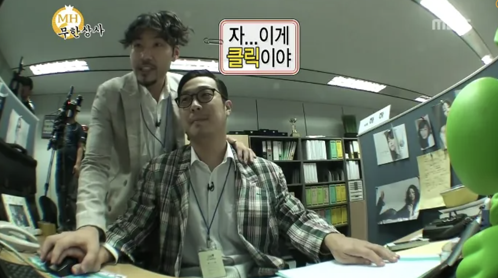  

~~그래도 마우스 오른쪽이 클릭이라는 건 알고 있었다. 아 왼쪽인가?~~

초등학교때는 친구들과 누가 타자를 더 빨리치나 내기를 했었는데 맨날 내기에서 져서 한번쯤은 이겨보려고 매일마다 한컴 타자 연습을 했던 기억이 있다. (메밀꽃 필 무렵을 그렇게 열심히 따라 쳤었다. 과장 조금 보태서 메밀꽃이 한 300번은 핀 것 같다... 결국에 한 번 이기고 다시는 그 친구랑 타자 내기 안했다. ㅎㅎ)

이렇게 타자 내기 할때랑 동생와 크레이지 아케이드 2인용을 할때말고는 컴퓨터와 함께하는 시간이 없었던 것 같다.

  

> 어릴적 나는 어떤 사람이었을까?

### 🎬 Chap1. 유년시절 이야기

나는 초등학교를 2군데 나왔다. 아버지 회사 때문에 2년동안 중국에 가야하는 일이 있어서 초등학교 2학년말에 중국으로 유학을 갔다가 국제학교를 2년 다니고 다시 5학년쯤에 한국으로 돌아왔다.

(성인이 되고 나서야 안 이야기인데 2년 유학이 끝날때쯤에 미국으로 아예 이민가서 살수 있는 기회가 있었다고 한다. 그런데 아버지는 한국행을 택하셨다고 한다. 그때 미국으로 갔으면 지금쯤 나는 어떻게 살고 있을까? 근데 난 한식을 넘 좋아해서 한국에 왔을듯 ㅎㅎ)

> 2년동안의 해외 생활은 외롭기도 했지만 재밌는 것도 많았다.

나는 [SSIS](https://www.suzhousinternationalschool.com/) 라는 국제학교에 다녔었다. 여기에는 국적이 정말 다양한 학생들이 있었다. (싱가폴, 중국, 덴마크, 핀란드, 대만, 캐나다 등등)

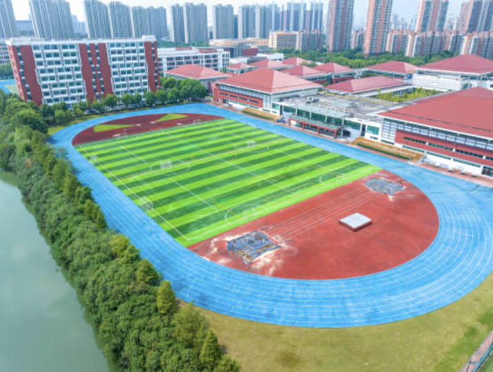  
학교는 이렇게 생겼다. 빨간색 지붕들이 강의실 및 체육시설들이고 실제로 보면 더 크다. 동화속에 나올법한 마을 느낌이었던 걸로 기억한다

처음 학교에 전학갔을때는 너무 외로웠다. 국제 학교라 수업은 영어로 진행됐었는데 나는 영어를 잘하지 못했기에 하고 싶은 말은 많은데 할 수 없는 그런 상황이었다. 할 수 있는 말은 `yes i can`정도...? (진짜 누가 나를 하루 아침에 무인도에 던져놓은 기분이었다. 강하게 자랐네 나...)

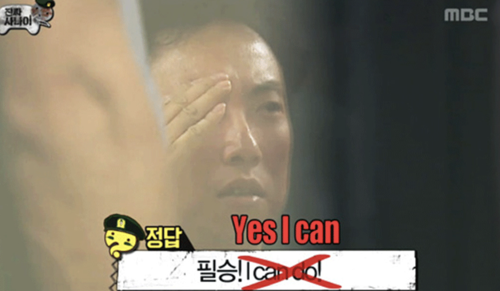  

그래서 영어 단어책을 사서 하루에 30개씩 영어 단어를 외웠고 엄마한테 영어과외 시켜달라고 졸라서 영어과외도 했다. (잘지내시죠? Rebecca, Tefi 선생님...)

나는 어렸을때도 체구가 큰 편은 아니었기에 새롭게 전학을 온 학교에서 친구들한테 괴롭힘을 당하지만 않으면 다행이라고 생각했다.

> 하지만 운동신경이 좋았던 덕분일까?

평소처럼 점심을 먹고 잔디밭에서 산책하고 있었는데 갑자기 외국인 친구가 다가와서 같이 축구를 하자고 했다. (아마 한명이 모자랐던듯?)

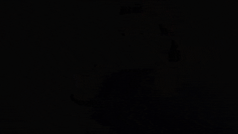  

이때는 그냥 가벼운 마음으로 축구를 했었는데 생각보다 내가 활약을 많이 하고 골도 많이 넣어서 이때 이후로 친구들과 친해지고 같이 점심도 먹고 맨날 축구만 했다.

진짜 이때 평생할 운동 다한 것 같다. 축구 뿐만아니라 수영, 플로어하키, 농구, 탁구, 테니스 등등 다 했다.

학교에 아래와 같은 시설이 있어서 체육시간이 너무 기다려졌던 것 같다.

이런곳에서 농구랑 플로어하키를 했었고,
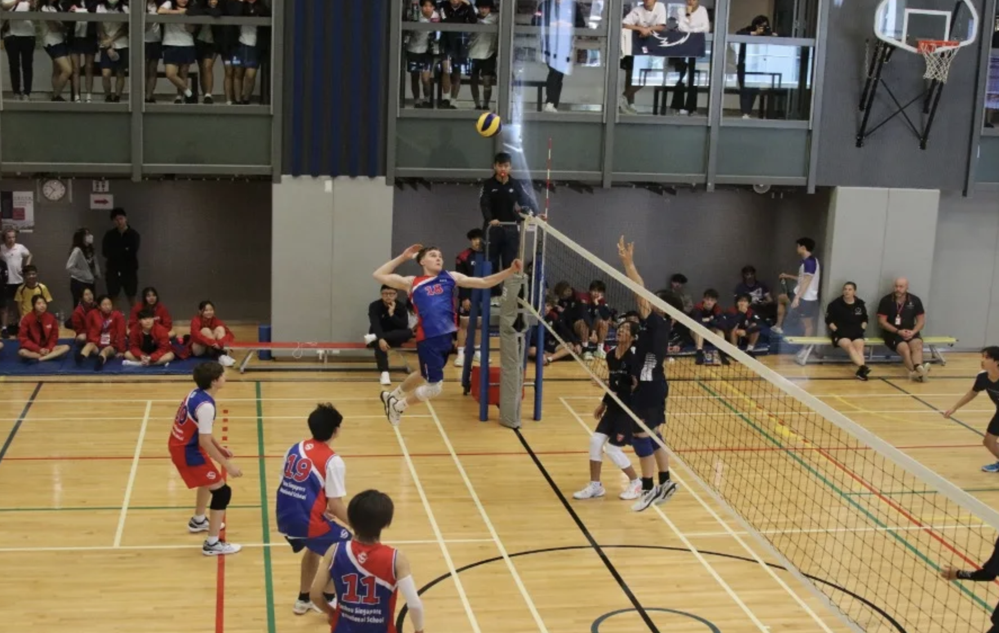  

여기서 수영도 했었다. (수영장 아래가 되게 깊었어서 아래찍고 올라오는 내기 했던 기억이... 재밌었다 ㅎㅎ)
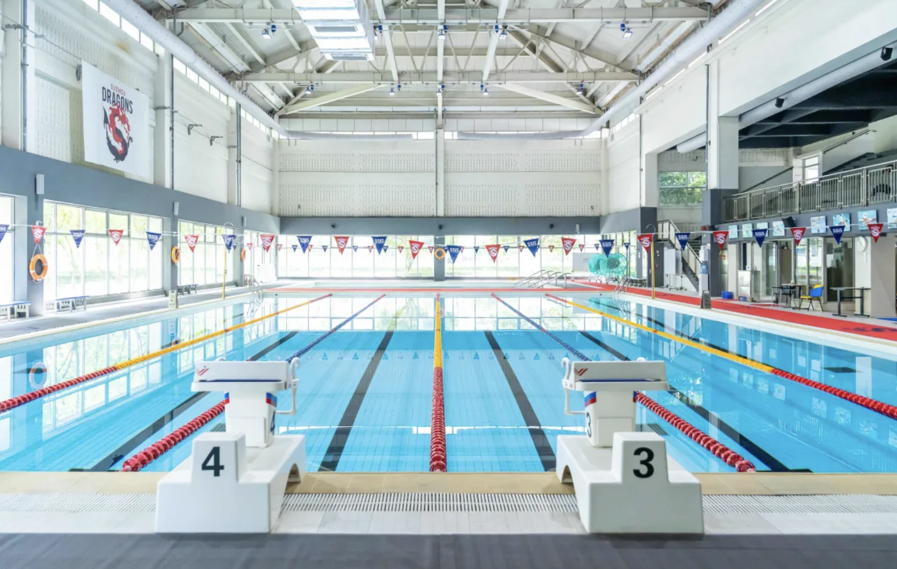  

이렇게 다사다난했던 중국 생활을 마치고 한국으로 다시 돌아왔다.

### 👀 중고등학교때는 사람들에 관심이 많았던 것 같다.

이 사람은 어떤사람이고 저 사람은 어떤사람인지를 관찰하는 것을 좋아했다.

또 학교나 사회에서 일어나는 일에도 관심이 있었어서 마음이 맞는 친구들을 모아 함께 ucc를 제작하기도 했다. (이때 장려상 받았던 것 같다.)

사실 ucc 영상은 2시간 걸려 다 찍었는데, 친구들과 함께 이런 저런 이야기를 하는게 좋아서 친구들을 꼬셔서 우리집에서 8명이 밤새서 이야기하며 놀고 다음날 같이 등교했다. (진짜 누가 주제하나 던지면 그 주제에 대해서 2개의 파로 나뉘어서 하루 종일 이야기했다.)

고등학교때는 방송부 활동도 했었다. 이런 [축제 영상](https://www.youtube.com/watch?v=VCb6Dp0avXY)도 찍었다. 나는 비위가 약해서 다른 친구가 찍어줬다. (비위가 약한분들은 보지 않는 것을 추천한다.)

학교 생각나서 유튜브에서 검색해봤는데 [이런 영상](https://www.youtube.com/watch?v=C-XrDgj1jlA)도 있다 ㅋㅋ
(그 시절 감성 뿜뿜)

> 그리고 이때 C언어라는 것도 처음 알게되었다.

방송부 활동을 하면서 친해진 친구가 있었는데 이 친구가 옆에서 맨날 무슨 책 보고 있길래 같이 봤었는데 이 책이 C언어 책이었다.

그때는 너는 무슨 이런 책을 보니? 하고 넘어갔었는데 그 이후로 이상하게 눈에 계속 밟혔고 뭔가 알수없게 이끌려서 이 책을 보게 되었다.

이때는 이 친구와 친해지려고 어떻게든 대화거리를 만들어보고자 C언어 공부를 했던 것 같다. (기억났는데 포인터 부분을 공부하다가 벽을 느껴서 잠시 책을 덮어두었던 기억이...)

나중에 이 친구가 웹 사이트도 만들길래 어깨너머로 훔쳐봤었다.
당시에 웹사이트를 만들고 있는 친구 옆에서 이건 뭐야? 하면서 질문을 엄청 했었다. 화면의 색깔도 바꿔달라고 하고 폰트 크기도 키워달라고 했었다. (아마 이때부터 프론트엔드에 관심이 있었던 것 같다 ㅎㅎ)

지금 생각해보면 이 친구 덕분에 멀게만 느껴졌던 컴퓨터에 한 걸음 가까워지게 된 것 같다!

### 🎬 Chap2. 성인이 된 이후

이렇게 무난하게 흘러가던 나의 생활에 처음으로 큰 어려움이 찾아왔다.

> 그것은 바로 수능!

결론적으로 나는 수능을 잘 못봤다. 고등학교때 공부를 별로 안했으니 예상된 결과였다.

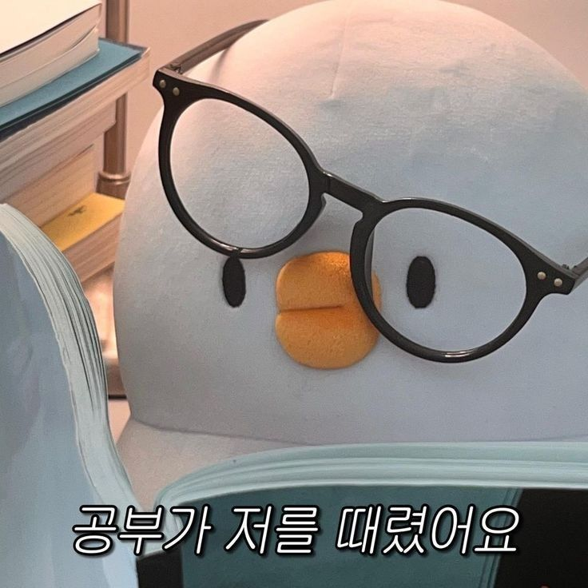  

그렇게 나는 `강남 청솔 기숙학원` 이라는 곳에서 재수 생활을 했다.

이때가 나의 삶에 있어서 처음으로 가장 힘들었던 경험이 아니었나 싶다.

고등학교때 친구들이 성인이되어 노는 것을 보면서 괴롭기도 했고 나는 왜 공부를 하지 않았을까? 스스로 자책도 많이 했던 것 같다.

> 심지어 스스로를 실패자로 낙인하기도 하였다.

그때는 자존감도 많이 낮아져 있었고 너무 힘들었어서 기숙학원 담임 선생님께 조언을 구하기도 했다.

혼자서 많이 울기도 했다
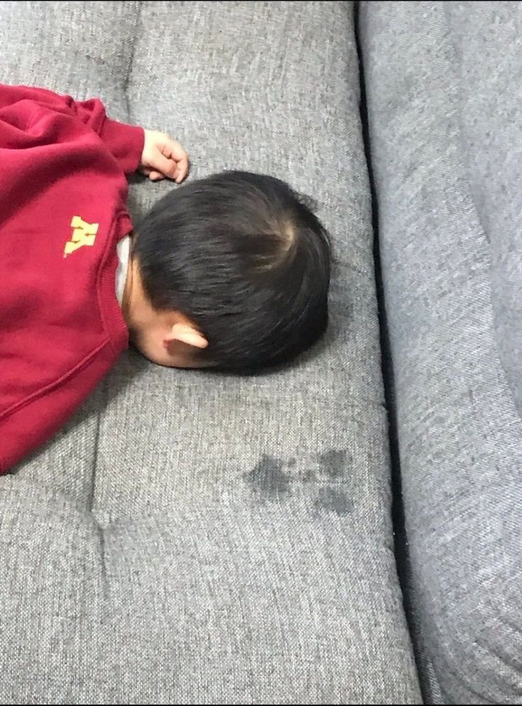  

그 당시 선생님께서는 아래와 같이 조언해주셨다.

> 1년의 재수를 시련으로 볼 것인지? 실패로 볼 것인지?는 너의 선택에 달려있어. 시련이 왔을때 이에 굴복하고 포기해버리면 실패가 되는거야. 하지만 시련을 견뎌내고 일어나면, 그 모든 시간들이 값지게 느껴질 거야."

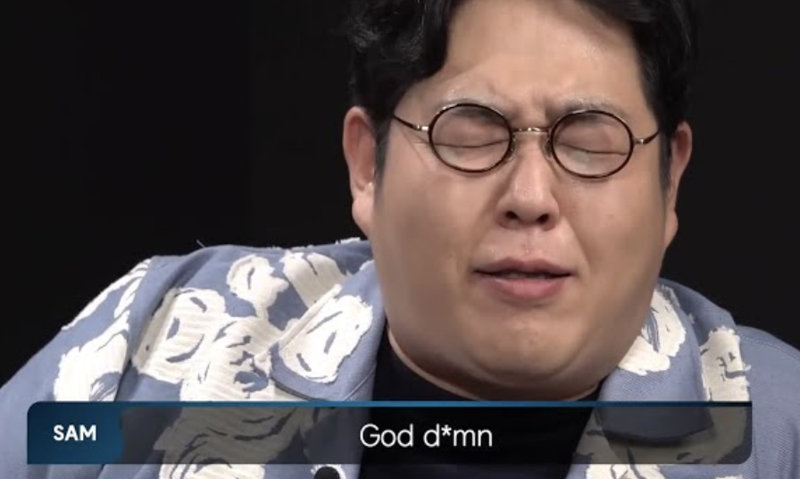  

이 조언을 듣고 나는 재수생활의 1년을 시련으로 넘기기 위해 1년동안 기숙학원에서 다른 사람들과 아무말도 안하고 미친듯이 공부를 했었던 것 같다.

공부를 별로 안한 노베이스에 가까웠기 때문에 진짜 살면서 가장 치열하게 공부한 1년이었다. (다시는 돌아가고 싶지 않은 것 같다.)

> 이때의 경험 덕분에 이제는 웬만한 어려움이 와도 그냥 시련으로 받아들이고 잘 넘겨내는 것 같다.

짧다면 짧고 길다면 긴 시간이 지났다.
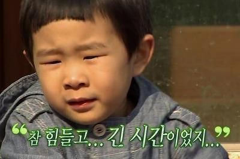  

결국 수능을 나름 잘 끝냈고, 고등학교때부터 관심이 있었던 컴퓨터공학과에 지원을 하여 합격을 할 수 있었다.

컴퓨터 공학과 1학년때는 처음으로 코드를 통해 뭘 만들고 싶다는 생각이 들었다. 그래서 구글링 하면서 찾아보던 중, `노마드코더`를 알게 되었고 강의를 보면서 처음으로 `코딩`이란 것을 했다.

이때는 기숙사에 살았었는데 내가 코딩한 작업물이 화면을 통해 보이는게 너무 신기했어서 수업 이후에는 기숙사에 들어와서 코딩을 했던 것 같다. (그 당시 룸메이트한테 내가 만든 작업물을 보여주면서 자랑도 했었다 ㅎㅎ )

## 🎬 Chap3. 계속 개발을 하는 이유

운이 좋게도 고등학교때 친구를 통해 C언어를 알게되어 컴퓨터와 가까워졌고, 내가 만든 코드가 화면을 통해 보이는게 너무 신기해서 개발을 시작하게 되었다.

> 나는 개발이 좋다.

첫 번째 이유는 일상생활에서 발생하는 크고 작은 문제들을 코드로 해결하는 방식이 매력적이기 때문이다. 또, 문제해결을 위해 해당 문제에 대해 관찰하고 더 나은 방법을 위해 깊이 고민을 하는 과정이 즐겁고 행복하기 때문이다.

> 개발자는 코드를 짜는 사람이 아닌 `문제를 해결하는 사람`이라고 생각한다.

문제를 잘 해결하기 위해서는 먼저 그 문제가 무엇인지 정의를 잘해야한다고 생각한다. 또, 문제 정의를 잘하기 위해서는 그 문제가 무엇인지 스스로가 잘 설명할 수 있어야 한다고 생각한다.

그래서 나는 문제를 잘 정의하기 위해 해결하고자 하는 하나의 큰 문제를 작은 여러 문제로 나누어서 바라본다. 그리고 경험상 이렇게 작은 문제로 나누면 큰 문제를 해결하는 것이 쉬워 졌던 것 같다.

최근 지인과 대화를 나누던 중, 본인은 프로젝트를 시작할 때 처음부터 '웹으로 할지, 앱으로 할지'를 결정하고 들어간다고 들었다. 그 이야기를 들으며 나는 자연스럽게 반대되는 생각이 떠올랐다. 나는 앱인지 웹인지를 미리 정하고 시작하는 것은 적절하지 않다고 생각한다. 앱이나 웹은 문제를 해결하기 위한 수단이지, 목적이 되어서는 안 되기 때문이다. (목적은 문제해결이 아닐까?)

실제로 어떤 문제를 해결하려고 할 때, 가장 중요한 것은 그 문제의 본질과 사용자에게 어떤 가치를 줄 수 있는지를 파악하는 것이지, 그것을 어떤 플랫폼으로 구현할지 먼저 결정하는 것이 아니라고 생각한다. 개인적으로 플랫폼 선택은 문제의 성격과 사용자 환경에 따라 나중에 결정되어야 할 문제라고 생각한다.

내게 개발이 매력적인 이유는 바로 이런 사고방식을 기반으로 문제에 접근하고, 다양한 가능성을 탐색하며, 그 과정 속에서 최적의 해답을 찾아가는 데 있다. 단순히 기술을 적용하는 것이 아니라, 진짜 문제를 찾아내고 그것을 가장 효과적으로 해결하는 방법을 고민하는 것. 이게 내가 생각하는 개발자의 본질이자 내가 개발을 좋아하는 첫 번째 이유다.

> 두 번째로 내가 개발을 좋아하는 이유는 `개발에 정답이 없다`고 느껴졌기 때문이다.

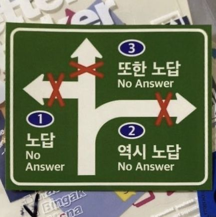  

개발을 하면서 느낀점은 같은 문제를 해결하더라도 개발자마다 접근 방식이 다르고, 사용하는 기술이나 도구도 다양하다는 것이다.

실제로 협업을 하다 보면 똑같은 기능을 구현하더라도 코드 스타일, 설계 방식, 데이터 처리 로직 등에서 다양한 의견이 나온다. 처음에는 무엇이 맞는 방법인지 고민하게 되지만, 서로의 이유를 듣다 보면 "정답은 하나가 아닐 수 있구나"라는 점을 다시금 느낀다. 중요한 건 단순히 결과를 맞추는 것이 아니라, 왜 그렇게 구현했는지에 대한 논리적인 근거와 맥락이 분명한가이다.

## 🎬 Chap4. 개발자로서 태도

> 개발을 하다 보면 개발을 잘하고 싶다는 생각을 떠올리는 것은 당연한 것 같다.

나 또한 개발을 잘하기 위해 끊임없이 고민하고 배우려는 노력을 하고 있다.

코드를 짤 때에도 단순히 기능이 동작하게 만드는 것을 넘어서, 다른 사람과 함께 일할 때 얼마나 읽기 쉬운 코드인지, 유지보수가 용이한 구조인지 등을 고민하게 된다. 특히 프론트엔드 개발자로서 디자이너, 백엔드 개발자와의 협업이 많기 때문에, 내 코드가 팀 전체의 흐름 안에서 어떤 역할을 하는지, 어떻게 하면 다른 사람이 내 코드를 더 쉽게 이해하고 사용할 수 있을지 항상 염두에 두게 되는 것 같다.

컴포넌트를 설계할 때도 혼자만의 기준이 아니라, 공통된 패턴을 따르고 명확한 네이밍을 사용하는 것, 협업하는 팀원이 쉽게 재사용하고 수정할 수 있도록 하는 것 등을 중요하게 생각한다.

> 때로는 코드 한 줄을 더 작성하더라도, 그게 팀 전체의 생산성과 커뮤니케이션에 도움이 된다면 그 선택이 더 옳다고 느낀다.

결국 개발을 잘한다는 것은 '코드를 잘 짠다'는 것을 넘어서, 함께 일하는 사람들과 좋은 흐름을 만들어가는 능력까지 포함된다고 생각한다. 그런 점에서 협업 과정에서의 코드에 대한 고민은 개발자로서 꼭 필요한 자세이자, 내가 계속해서 발전해 나가고 싶은 방향이기도 하다.

## 🎬 Final. 지속가능한 개발자

> 나는 지속가능한 개발자가 되고 싶다.

그렇다면 지속가능한 개발자가 되기 위해 나는 어떠한 노력을 하고 있을까?

- 스스로 부족한 부분을 찾고 이를 채우자
- 혼자가 아닌 함께 성장하자
- 깊이 있게 개발하자

### 🍪 스스로 부족한 부분을 찾고 이를 채우자

개발자로서 지속적으로 성장하기 위해서는 스스로 부족한 부분을 정확히 인식하고 그것을 채워나가야 한다고 생각한다.

특히 사용자와 직접 맞닿는 영역을 다루는 프론트엔드 개발자는 단순히 화면을 만드는 것을 넘어, 사용자의 요구사항을 민감하게 읽고, 그 변화에 유연하게 대응할 수 있어야 한다.

이러한 유연한 개발을 위해서는 단순히 눈앞의 기능을 구현하는 것에 그치지 않고, 기본기와 원리에 대한 깊은 이해, 즉 **CS 지식**을 바탕으로 사고하는 것이 중요하다고 생각한다.

그래서 나는 프론트엔드 개발과 밀접한 컴퓨터 네트워크, 운영체제,브라우저 렌더링 구조, 자바스크립트 실행 방식 등의 개념을 꾸준히 학습하고 있다. 단순히 면접 준비를 위한 암기가 아니라, 실무에서 마주치는 문제를 더 깊이 이해하고 근본적인 해결책을 찾기 위한 기반을 다지기 위해서다.

나는 과거에 무한 스크롤 기능을 구현할 일이 있었다. 처음에는 scroll 이벤트를 사용해 사용자가 페이지 하단에 도달했을 때 데이터를 불러오는 방식으로 구현했지만, 스크롤 이벤트가 너무 자주 발생하면서 성능 저하 문제가 생겼다. 이로 인해 사용자 경험이 떨어지고, 특히 저사양 기기에서는 렌더링 지연까지 발생했다.

문제의 원인을 파악하기 위해 브라우저의 이벤트 처리 방식과 렌더링 구조를 공부했고, 이 과정에서 `Intersection Observer API`를 알게 되었다. 이 API는 DOM 요소가 뷰포트 내에 들어오는지를 비동기적으로 감지할 수 있기 때문에, 기존의 scroll 이벤트처럼 매번 연산하지 않아도 되고, 브라우저가 효율적으로 최적화할 수 있는 구조였다.

이를 적용하면서, 불필요한 스크롤 이벤트 리스너를 제거하고, 마지막 콘텐츠 요소를 타겟으로 관찰하여 해당 요소가 뷰포트에 들어올 때만 새로운 데이터를 불러오도록 개선했다. 그 결과 이전보다 렌더링 지연이 줄어들고, 성능이 눈에 띄게 향상되었으며, 코드 구조도 훨씬 단순하고 명확해졌다.

> 단순히 기능을 구현하는 것을 넘어, 어떤 기술이 왜 적합한지 이해하고 설계하는 경험이었다.

또한 이와 같은 문제 해결 경험은 CS 지식의 중요성을 더 절실히 느끼게 해주었다.

리스트 화면에 무한 스크롤 기능을 구현할 때, 사용자가 빠르게 스크롤하면 짧은 시간 안에 API 요청이 과도하게 발생하는 문제가 있었다. 이로 인해 서버에는 부하가 생겼고, 클라이언트 측에서도 응답 지연이 발생하면서 사용자 경험이 저하됐다.

이 문제를 해결하기 위해, 이벤트 처리 방식과 비동기 네트워크 요청 구조에 대해 다시 학습했고, 그 결과 스크롤 이벤트에 쓰로틀을 적용해 요청 빈도를 제어했다. 결과적으로 이를 통해 불필요한 호출을 줄이고, 네트워크 부하를 최소화하면서도 사용자에게는 자연스럽고 끊김 없는 로딩 흐름을 제공할 수 있었다.

또한 운영체제의 메모리 관리 방식에 대한 개념을 학습하면서, 브라우저 환경에서의 리소스 최적화가 왜 중요한지 더 깊이 이해할 수 있었다. 운영체제에서 메모리는 제한된 자원이기 때문에 효율적으로 할당하고, 필요 없어진 데이터는 가비지 컬렉션을 통해 해제한다는 구조를 학습했다.

이 구조를 이해하니, 프론트엔드 개발에서도 불필요한 리소스를 계속해서 메모리에 올려두는 것이 성능 저하로 이어질 수 있다는 점을 더 명확하게 인식하게 되었다.

이를 바탕으로 실제 프로젝트에서는, 사용자가 보고 있지 않은 이미지나 컴포넌트를 계속 렌더링하거나, DOM에 남겨두는 구조를 피하고자 했다.

이전에는 리스트 페이지에서 사용자가 스크롤을 내릴수록 콘텐츠가 계속 누적되는 구조였는데, 사용자가 더 이상 보지 않는 DOM 요소는 제거하고, 필요한 시점에만 다시 렌더링하는 방식으로 개선했다. 또한 이미지 리소스는 loading="lazy" 속성을 적극 활용하거나, Intersection Observer를 통해 화면에 노출되는 시점에만 네트워크 요청을 보내도록 최적화했다.

이러한 최적화를 통해 단지 페이지 로딩 속도만 개선하는 것이 아니라, 사용자의 디바이스 메모리 사용량을 줄이는데에 도움을 줄 수 있었다.

이처럼 단순히 기능을 구현하는 것을 넘어, 문제의 근본적인 원인을 이해하고, 그에 맞는 구조적인 개선을 적용하는 과정에서 CS 기반의 사고가 얼마나 중요한지를 다시 한번 느낄 수 있었다.

### 🍪 혼자가 아닌 함께 성장하자

> 개발을 하면서 가장 크게 느낀 점 중 하나는, 혼자 공부하는 데에는 분명한 한계가 있다는 것이다.

내가 만든 코드나 문제 해결 방식이 올바른지 확인할 수 있는 피드백이 없다면, 잘못된 방향으로 오랜 시간을 보내게 될 수도 있다고 생각한다.

> 그래서 나는 다양한 사람들과 함께할 수 있는 환경 속에서 배우려 노력해왔다

나는 개발자 동아리와 커뮤니티 활동을 통해 정말 많은 성장을 경험했고, 이 경험을 많은 사람들과 나누고 싶을 만큼 소중하게 생각한다.

학생 때 여러 개발 동아리에 참여하면서 좋은 사람들을 만나게 되었고, 그 안에서 나눈 기술적인 대화나 협업 경험은 지금도 큰 자산이 되고 있다.

나 혼자였다면 알기 어려웠을 정보들도 자연스럽게 공유되고, 예상치 못한 기회로 연결되기도 했다.

혼자 공부할 땐 내가 아는 만큼만 성장하지만, 함께 공부하면 서로의 경험과 지식을 통해 시야를 훨씬 넓힐 수 있다. (같은 시간을 들이더라도 열 명이 함께 공부하면 열 배의 지식을 얻을 수 있다는 말에 깊이 공감한다.)

이런 생각을 바탕으로, 나는 다양한 활동에 참여하며 혼자보다 함께 성장하는 경험을 꾸준히 쌓아왔다.

syncspot, pinoco 프로젝트와 같은 협업 중심의 프로젝트에서는 팀원들과 역할을 나누고 함께 기능을 구현하며, 실제 협업 환경에서 문제를 해결하고 소통하는 역량을 키울 수 있었다.

JavaScript 딥다이브 스터디에서는 매주 발표와 토론을 통해 개념을 더 깊이 있게 정리하고, 다른 사람의 질문을 통해 나의 이해도를 확인할 수 있는 시간을 가졌다.

또한, IT 동아리에서 프론트엔드 파트장으로 활동하며 함께 성장하는 문화를 직접 이끌어본 경험도 있다.

파트장으로 활동하면서 계산기 구현 과제를 제시하고, 파트원들과 함께 서로의 코드를 리뷰하는 시간을 가졌다. 이 과정에서 각자 다른 방식으로 구현된 코드를 보며, 같은 문제를 다양한 시각으로 풀어가는 접근 방식을 경험했고, 사고의 폭이 넓어지는 계기가 되었다.

최근에는 Farm System과 구름톤 유니브 같은 활동에도 새롭게 참여하고 있다.

Farm System은 웹 개발 과정에서 보안에 대한 고민을 바탕으로 참여하게 된 활동으로, 실제 서비스에 필요한 기능을 구현하면서 동시에 보안적으로 안전한 프론트엔드 구조를 고민하고 적용하는 경험을 하고 있다.

구름톤 유니브에서는 다양한 배경을 가진 참가자들과 협업하며, 짧은 시간 안에 아이디어를 구현하고 실시간으로 피드백을 주고받는 해커톤 경험을 쌓고 싶어서 지원하게 되었다.

그 밖에도 오픈카톡 커뮤니티를 통해서도 많은 자극과 배움을 얻고 있다.
‘테오의 프론트엔드’와 같은 커뮤니티에서는 다양한 개발자들과 경험을 공유하고, 진로에 대한 고민이나 기술적인 어려움을 함께 이야기 나눌 수 있었다. 나 역시 그 안에서 새로운 정보와 인사이트를 얻으며, 문제를 바라보는 시야를 넓힐 수 있는 좋은 계기가 되었다.

> 앞으로도 혼자 고민에 갇히기보다는, 사람들과 함께 부딪히고 배우며 성장하는 개발자가 되고 싶다.

### 🍪 깊이 있게 개발하자

> 마지막으로, 나는 깊이 있는 개발자가 되고 싶다.

개발을 처음 시작했을 땐 다양한 기술을 넓게 접해보고 싶은 욕심이 컸다.
React, Vue, Svelte 중 어떤 게 더 좋은지 고민했고, 타입스크립트를 지금 써야 하는지도 헷갈렸다. 심지어 프론트엔드를 막 시작했을 때, 스프링까지 공부해볼까 생각한 적도 있었다.

> 하지만 시간이 지날수록 하나를 깊이 있게 이해하는 것이 진짜 실력을 만든다는 사실을 알게 되었다.

그래서 최근에는 JavaScript 딥다이브 스터디를 시작했다. React를 사용해 프로젝트를 만들고 있지만, 그 기반이 되는 자바스크립트를 제대로 이해하지 못한다면 문제의 원인을 정확히 분석하거나 성능을 최적화하는 데에 한계가 있다는 걸 느꼈기 때문이다.

단순히 동작하는 코드를 넘어서, 왜 그렇게 동작하는지, 메모리는 어떻게 관리되는지, 비동기 흐름은 어떻게 이어지는지 등을 깊이 있게 이해하는 것이 앞으로의 성장에 반드시 필요하다고 생각했다.

나는 그래서 무엇이든 "일단 하나라도 제대로" 공부하는 것이 중요하다고 생각한다.

> 내가 말하는 ‘깊이 있는 개발’은 단순히 코드를 잘 짜는 것을 의미하지 않는다.

'깊이 있는 개발'은 사용자 경험을 고민하고, 성능을 고려하며, 문제의 본질을 파악하고 논리적으로 해결하려는 태도라고 생각한다.

실제로 최근 프로젝트에서도 기능 구현 자체보다 사용자 경험을 어떻게 더 나은 방향으로 개선할 수 있을지에 대해 고민해보았다.

처음에는 페이지가 렌더링될 때마다 서버로부터 글 목록을 요청했는데, 글 내용에 변경이 없어도 매번 네트워크 요청이 발생하는 비효율적인 구조였다.
사용자 입장에서는 로딩이 느려지고, 서버 자원도 불필요하게 소모되는 상황이었다.

이 문제를 해결하기 위해, 글 목록이 변경되지 않은 경우에는 기존 데이터를 캐싱해서 재활용하는 구조로 개선했다.
캐싱 라이브러리를 도입하고, 상태 관리 전략을 재설계하면서 불필요한 요청을 줄이고 페이지 로딩 속도를 개선할 수 있었다.

단순히 기능이 작동하게 만든 것이 아니라, 사용자의 관점에서 어떤 부분이 불편했는지 고민하고, 그것을 기술적으로 풀어낸 경험이었다. 이 과정을 통해 성능 최적화는 단지 기술적인 문제가 아니라, 사용자 만족도와 직결되는 핵심 가치라는 것을 몸소 느낄 수 있었다.

앞으로도 나는 단지 코드를 작성하는 개발자가 아니라, 왜 이 방식이 적절한지, 다른 더 나은 방법은 없는지, 이 코드가 사용자 경험에 어떤 영향을 주는지 끊임없이 질문하고, 그에 대한 답을 설명할 수 있는 개발자가 되고 싶다.

“일단은 동작하게 만들고 그 다음 제대로 만들고, 그다음에 빠르게 작동하게 하라”는 말처럼 앞으로도 기능을 넘어서 품질을 고민하는 개발자, 문제를 정확히 이해하고 해결하는 깊이 있는 개발자로 성장해 나가고 싶다.

## 🙇🏻 글을 마치며

최근 취업 준비를 하면서 어느 순간부터 ‘개발을 잘하고 싶다’는 마음보다 ‘취업을 해야 한다’는 압박감이 들었던 것 같다.

나 역시 취업을 준비하는 입장이지만, 시간이 지날수록 단순히 취업만을 위해 공부하는 건 오히려 내 방향을 흐리게 만들 수 있다는 생각이 들었다.

기술 하나를 선택할 때도, 어떤 프로젝트를 시작할 때도 내가 진짜 배우고 싶은 게 뭔지, 왜 이걸 하고 싶은지를 자주 놓치게 되는 것 같다.

> 정작 중요한 건 나 자신에 대한 이해와 선택의 이유인데...

그걸 잊고 남들이 하니까 따라 하거나, ‘이걸 하면 괜찮겠지’라는 막연한 기준으로 움직일 때가 있다.

그래서 나는 요즘, 어떤 기술을 접할 때마다 이게 나에게 어떤 의미가 있는지, 내가 해결하려는 문제에 적합한 선택인지, 직접 사용해보며 무엇을 느꼈는지를 스스로에게 묻는 습관을 들이고 있다.

단지 유명하거나 필요하다는 이유만으로 접근하기보다는, 몰랐던 개념을 이해했을 때의 즐거움, 하나의 원리를 내 언어로 설명할 수 있을 때의 뿌듯함 같은 감정을 따라가며 공부하려고 한다.

나는 아직 개발자로서의 여정을 걸어가는 중이다.
그래서 더더욱 **"어떤 회사를 갈 것인가"보다는 "어떤 개발자가 될 것인가"**를 고민하게 된다.
결국, 내가 어떤 문제를 어떻게 해결해왔는지가
어디에서 일하느냐보다 훨씬 더 오래 나를 지탱해줄 것이라 믿기 때문이다.

> 세상은 빠르게 바뀐다. (올해도 벌써 3월이 다갔다... 1월1일에 인왕산 등반했을때가 엊그제 같은데...)

지금 눈에 보이는 ‘좋은 회사’가 영원하지 않을 수도 있고,
내가 만들고 싶은 무언가가 미래에는 더 중요한 가치를 지닐 수도 있다.
그래서 나는 외부의 조건보다, 내가 쌓아가는 실력과 태도에 집중하고 싶다.

좋은 회사에 들어가는 것보다, 어떤 문제 앞에서도 꾸준히 배우고 성장할 수 있는 개발자로 살아가는 것.
그게 지금의 내가, 그리고 앞으로의 내가 가장 중요하게 생각하는 방향이다.

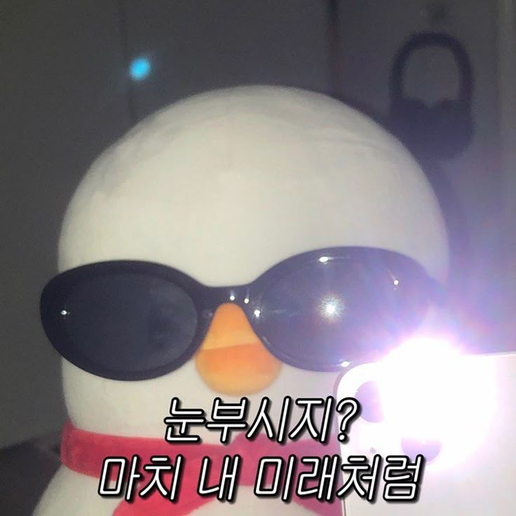  
