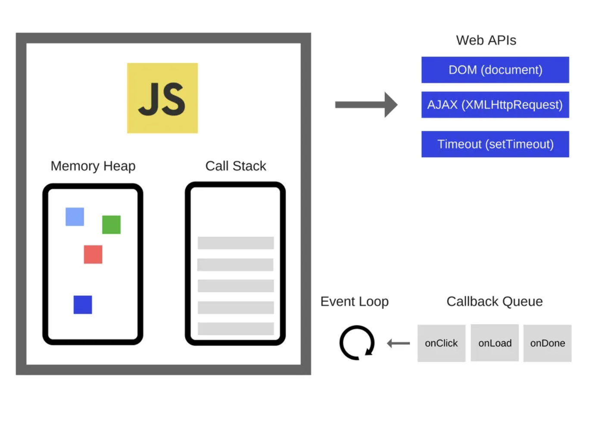

<br/>

## 🎯 자바스크립트는 `싱글 스레드` 언어이다.

<br/>

자바스크립트는 싱글 스레드 언어로, 한 번에 하나의 작업만 처리할 수 있다. (이러한 특성 때문에 자바스크립트는 자바나 C++처럼 여러 스레드를 병렬로 활용하는 멀티스레드 언어와는 다른 방식으로 동시성을 처리하게 된다.)

> 그렇다면 자바스크립트로는 동시에 여러 작업을 할 수 없는 것일까?

그렇지 않다!

<br/>

자바스크립트는 네트워크 요청, 타이머, 사용자 입력 등 다양한 비동기 작업들을 마치 동시에 실행되는 것처럼 효율적으로 처리할 수 있는데, 이 모든 동작의 중심에는 바로 `이벤트 루프`라는 메커니즘이 있다.

## 🔁 이벤트 루프?

자바스크립트는 기본적으로 메인 스레드에서 실행되며, 이 메인 스레드는 아래의 영역들로 나뉘어 동작한다.

<br/>

### 📦 콜 스택

함수 호출이 일어나는 공간으로, 동기적 코드가 실행되는 구조이다. 함수가 호출되면 스택에 쌓이고, 실행이 끝나면 스택에서 제거된다.

### 📦 Web API

브라우저나 Node.js가 제공하는 기능 영역으로, setTimeout, fetch, DOM 이벤트 등 비동기 작업이 이곳에서 처리된다.

### 📦 매크로태스크 큐

setTimeout, setInterval, DOM 이벤트 콜백 등 일반적인 비동기 작업의 콜백 함수들이 대기하는 큐이다. 이 큐에 들어있는 작업은 콜 스택이 비었을 때 하나씩 실행된다.

### 📦 마이크로태스크 큐

Promise.then, catch, finally, MutationObserver 등의 마이크로태스크가 대기하는 큐이다. 이벤트 루프는 콜 스택이 비는 즉시, 태스크 큐보다 먼저 마이크로태스크 큐를 모두 비우는 작업을 수행한다.

> 이벤트 루프는 위 구조를 기반으로 아래의 순서로 무한히 반복된다.

- 1️⃣ 자바스크립트는 코드를 콜 스택에 쌓아 한 줄씩 실행한다.

- 2️⃣ 수행할 작업중 비동기 작업(setTimeout, Promise 등)은 즉시 실행되는 것이 아니라 Web API로 위임된다.

- 3️⃣ Web API가 작업을 마치면, 그에 해당하는 콜백을 매크로태스크 큐 또는 마이크로태스크 큐에 넣는다.

- 4️⃣ 콜 스택이 비면, 이벤트 루프는 먼저 마이크로태스크 큐의 작업을 모두 처리한 후, 매크로태스크 큐에서 하나씩 꺼내 콜 스택에 넣어 실행한다.

- 5️⃣ 위 과정이 무한 반복되면서 비동기 작업들이 적절히 처리된다.

이러한 구조 덕분에 자바스크립트는 싱글스레드임에도 불구하고 마치 여러 작업을 동시에 처리하는 것처럼 보이게 할 수 있는 것이다.

(자바스크립트의 Event Loop에 대해 좋은 참고 영상이 있어서 참고하면 좋을 것 같다! 👉🏻 [참고 영상](https://www.youtube.com/watch?v=8aGhZQkoFbQ))

### 예시를 통해 이해해보자.

```javascript
console.log('1');

setTimeout(() => {
  console.log('2');
}, 0);

Promise.resolve().then(() => {
  console.log('3');
});

console.log('4');
```

위 코드의 실행결과는 다음과 같다.

```
1
4
3
2
```

먼저 동기적으로 실행되는 1과 4가 콜 스택에서 바로 실행된다. 그 다음으로 Promise의 콜백인 3이 마이크로태스크 큐에 들어가 있다가 동기 코드 실행이 끝난 직후 처리된다. 마지막으로 setTimeout의 콜백인 2가 매크로태스크 큐에 들어가 있다가 가장 나중에 실행되어 위와 같은 결과가 출력된다.

> 또 다른 예시를 보자.

```javascript
const fetchData = () => Promise.resolve('데이터 로드 완료!');

async function processData() {
  console.log('함수 시작!');
  const result = await fetchData();
  console.log(result);
}

console.log('함수 호출 전!');
processData();
console.log('함수 호출 후!');
```

이 코드를 실행하면 아래와 같은 출력 결과가 나타난다

```
함수 호출 전!
함수 시작!
함수 호출 후!
데이터 로드 완료!
```

### 실행 흐름 설명을 설명해보자면

먼저, `console.log('함수 호출 전!')`이 실행되어 "함수 호출 전!"이 출력된다. (이 코드는 동기적으로 바로 실행된다.)

다음 줄에서 `processData()`가 호출된다. 이때 비동기 함수인 `processData` 내부의 코드가 실행되며, 가장 먼저 "함수 시작!"이 출력된다.

그 다음 줄의 `await fetchData()`에서 비동기 작업이 시작된다. 이 시점에서 `fetchData()`는 즉시 해결되는 Promise를 반환하지만, `await` 키워드에 의해 `processData` 함수의 실행은 잠시 중단되고, 제어권은 다시 메인 실행 흐름으로 넘어간다.

그래서 `console.log('함수 호출 후!')`가 이어서 실행되며, "함수 호출 후!"가 출력된다.

그 후, `await fetchData()`가 완료되면 중단되었던 `processData` 함수가 다시 실행을 재개하며, `result`에 "데이터 로드 완료!"가 할당되고 마지막으로 "데이터 로드 완료!"가 출력된다.

> 만약 `await processData()`로 호출하였다면 어떻게 될까?

그렇다면 출력 결과는 다음과 같을 것이다.

```
함수 호출 전!
함수 시작!
데이터 로드 완료!
함수 호출 후!
```

그 이유는 `await processData()` 덕분에 `processData` 함수의 실행이 끝날 때까지 다음 줄로 넘어가지 않기 때문에, "데이터 로드 완료!"가 출력된 이후에 "함수 호출 후!"가 출력되기 때문이다.

## 🤔 이벤트 루프로 감당할 수 없는 일

앞서 우리는 자바스크립트가 싱글 스레드 언어라는 점과, 이벤트 루프를 활용해 비동기 작업을 효율적으로 처리하는 구조에 대해 살펴봤다.

> 그런데 여기서 중요한 사실이 하나 있다.

이벤트 루프는 "비동기 I/O" 처리에는 강하지만, "무거운 계산" 같은 CPU 중심 작업에는 약하다는 것이다.

왜냐하면 자바스크립트의 실행 환경에는 오직 하나의 메인 스레드만 존재하기 때문이다.

> 사용자가 어떤 버튼을 눌렀을 때, 이미지 필터를 적용하거나 수천 개의 데이터를 정렬하거나, 복잡한 수식을 계산해야 한다고 생각해보자.

이런 작업을 메인 스레드에서 처리하게 되면, 계산이 끝날 때까지 화면 렌더링도, 사용자 입력도 멈추게 된다.

"비동기 처리로도 UI 멈춤 없이 할 수 있는 거 아니야?" -> `불가능하다`

<br/>

비동기는 작업을 위임해서 기다리는 동안 UI를 그릴 수 있게 해주는 것이지,
계산 자체의 비용을 줄여주진 않는다.

### 👀 그럼 다음과 같은 생각이 들 수 있다.

> “자바스크립트는 싱글 스레드라며? 그런데 Web Worker는 별도 스레드에서 실행된다던데?
> 그럼 결국 멀티스레딩 되는 거 아냐?”

싱글 스레드라면서 동시에 다른 스레드가 동작한다니, 어딘가 앞뒤가 안 맞아 보이니까 이상해 보일 수 있다.

하지만 이벤트 루프만으로는 감당하기 어려운 순간들이 존재한다. 대표적으로 복잡한 계산이나 이미지 처리처럼, 시간이 오래 걸리는 작업들이 그렇다.

> 바로 이런 문제를 해결하기 위해 등장한 게 Web Worker다.

## 🛠️ Web Workers가 등장한 이유

자바스크립트는 싱글 스레드 구조로 인해, 복잡하고 오래 걸리는 연산( 대규모 배열 정렬, 이미지 처리 등)을 메인 스레드에서 실행하면 브라우저가 멈춘 것처럼 느껴지는 문제가 생긴다. 이로인해 사용자는 UI가 얼어버린 것처럼 보이기 때문에 UX가 나빠질 수 있다.

> 이러한 문제는 Web Workers를 통해 해결할 수 있다.

Web Workers는 자바스크립트에서 장시간 실행되는 연산을 메인 스레드와 분리하여 백그라운드에서 실행할 수 있게 해주는 수단이다.

즉, 자바스크립트의 싱글 스레드 구조를 유지하면서도, 무거운 작업을 따로 떼어내어 실행할 수 있도록 만든 제한적인 멀티스레딩 도구인 셈이다.

## 🧵 Web Workers를 통한 제한적 멀티스레딩

자바스크립트는 기본적으로 하나의 스레드(메인 스레드)에서 코드가 순차적으로 실행된다. 하지만 브라우저 환경에서는 Web Workers라는 기능을 통해 추가적인 스레드를 생성하고, 그 안에서 자바스크립트 코드를 병렬로 실행할 수 있다.

### Web Worker는 다음과 같은 특징을 가진다

✅ 메인 스레드와 완전히 분리된 환경
Worker는 window나 document 같은 브라우저 객체에 접근할 수 없다. 즉, DOM 조작은 절대 불가능하다. 메인 스레드와 완전히 분리된 공간에서 실행되기 때문이다.

✅ 메모리 공유 없음
전통적인 멀티스레딩 언어(Java, C++ 등)는 여러 스레드가 같은 메모리를 공유할 수 있지만, Web Worker는 메모리를 공유하지 않는다. 대신 postMessage() 메서드를 통해 데이터를 복사하여 전달한다. (참고로 SharedArrayBuffer를 사용하면 일부 메모리 공유는 가능하지만, 사용 조건이 까다롭다고 한다...)

✅ 메시지 기반 통신
Worker와 메인 스레드는 postMessage()와 onmessage 이벤트를 통해 데이터를 주고받는다.

## 😃 web Worker를 한 번 사용해보자!

> 직접 코드를 통해 확인해보자!

사용자가 버튼을 누르면 45번째 피보나치 수를 계산하는 프로그램을 만든다고 해보자.

이 계산은 CPU 연산이 많기 때문에 메인 스레드에서 실행하면 UI가 잠시 멈추는 현상이 발생할 수 있다.
하지만, 이를 Web Worker로 분리하면, UI는 멈추지 않고 계산 결과만 받아올 수 있다.

## 1️⃣ 메인 스레드에서 직접 계산 – UI 멈춤 발생

```html
<!DOCTYPE html>
<html lang="ko">
  <head>
    <meta charset="UTF-8" />
    <title>피보나치 계산기 (메인 스레드)</title>
  </head>
  <body>
    <h1>🧮 피보나치 계산기 (메인 스레드)</h1>
    <button id="calcBtn">피보나치 계산</button>
    <p id="result">결과가 여기에 표시됩니다.</p>

    <script>
      function fibonacci(n) {
        if (n <= 1) return n;
        return fibonacci(n - 1) + fibonacci(n - 2);
      }

      document.getElementById('calcBtn').addEventListener('click', () => {
        document.getElementById('result').innerText = '계산 중...';
        const result = fibonacci(45);
        document.getElementById('result').innerText = `결과: ${result}`;
      });
    </script>
  </body>
</html>
```

위와 같이 `index.html`을 작성하고 이를 실행하면 다음과 같이 보이게 된다.

<br/>

영상을 보면 알 수 있듯, 버튼을 클릭하자마자 브라우저가 약 1~2초 동안 멈춘 듯한 느낌을 준다.

심지어 '계산 중...'이라는 문구조차 표시되지 않고, 그 순간 동안 UI가 아예 먹통이 된 것처럼 보인다.

이는 fibonacci(45)처럼 연산량이 많은 작업을 메인 스레드에서 처리했기 때문이다.

> 이를 해결하기 위해 Web Worker를 활용해보자!

## 2️⃣ Web Worker로 분리하여 병렬 처리

이번엔 Web Worker를 활용해서 계산은 백그라운드에서,
UI는 메인 스레드에서 부드럽게 유지되도록 해보자.

`index.html`

```html
<!DOCTYPE html>
<html lang="ko">
  <head>
    <meta charset="UTF-8" />
    <title>피보나치 계산기 (Web Worker)</title>
  </head>
  <body>
    <h1>🧮 피보나치 계산기 (Web Worker)</h1>
    <button id="calcBtn">피보나치 계산</button>
    <p id="result">결과가 여기에 표시됩니다.</p>

    <script type="module" src="main.js"></script>
  </body>
</html>
```

`main.js`

```javascript
const worker = new Worker('worker.js');

document.getElementById('calcBtn').addEventListener('click', () => {
  document.getElementById('result').innerText = '계산 중...';
  worker.postMessage(45); // Worker에게 숫자 전달
});

worker.onmessage = function (e) {
  document.getElementById('result').innerText = `결과: ${e.data}`;
};
```

`worker.js`

```javascript
function fibonacci(n) {
  if (n <= 1) return n;
  return fibonacci(n - 1) + fibonacci(n - 2);
}

onmessage = function (e) {
  const result = fibonacci(e.data);
  postMessage(result); // 결과를 메인 스레드로 전달
};
```

결과를 보면 아래와 같다.

<br/>

이전과는 달리 버튼을 눌러도 브라우저가 멈추지 않고, UI도 정상적으로 반응하는 것을 확인할 수 있다.

버튼을 클릭하면 먼저 '계산 중...'이라는 메시지가 표시된다.
그 사이 계산은 백그라운드 스레드에서 조용히 처리되며 처리 과정이 끝나면 사용자에게 계산 결과가 보여지게 된다.

즉, 무거운 연산을 Web Worker로 분리함으로써,
메인 스레드가 UI 렌더링과 사용자 입력을 계속해서 부드럽게 처리할 수 있었던 것이다.

## 🤔 Web Worker는 멀티스레딩이라고 할 수 있을까?

Web Worker는 실제로 메인 스레드와는 별도의 스레드에서 실행된다.

위의 예시에서도 보았듯이 계산은 백그라운드에서, UI는 메인 스레드에서 처리되어 마치 멀티스레딩처럼 느껴진다.

> 그렇다면 “자바스크립트는 Web Worker를 통해 멀티스레딩을 지원한다”고 말해도 될까?

Web Worker는 전통적인 멀티스레딩과는 구조적으로 다르다.

Java나 C++ 같은 언어에서의 멀티스레딩은 스레드 간 공유 메모리를 기반으로 하고, 때로는 경쟁 상태를 방지하기 위한 락(lock)이나 동기화 기법이 필요하다.

> 하지만 Web Worker는 다음과 같은 특징을 갖는다

- DOM 접근 불가
- 메모리 공유 불가 (SharedArrayBuffer는 예외지만 복잡함)
- postMessage() 기반 메시지 복사 통신

즉, 실제 스레드 분리는 일어나지만, 메모리도 공유하지 않고 DOM에도 접근하지 못하는 '격리된 환경'에서만 작동하기 때문에, 우리가 흔히 떠올리는 멀티스레딩이라고 부르기에는 애매할 것 같다.
