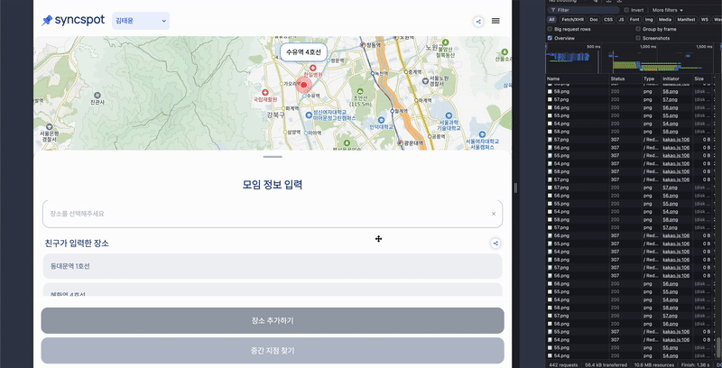
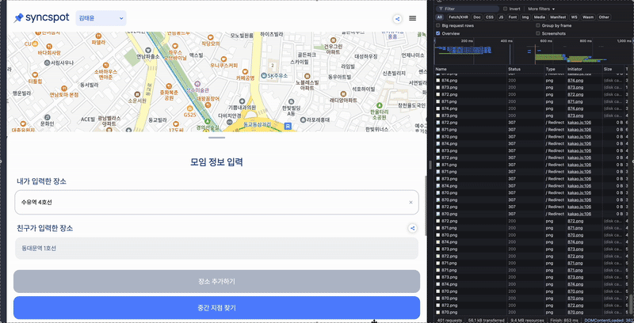

 <br/>

검색 기능을 구현하다 보면 자주 마주치게 되는 문제들이 있다. 특히 사용자 입력에 따라 자동완성 기능을 제공할 때는, 작은 입력 하나하나가 API 호출로 이어지면서 성능과 UX를 크게 해칠 수 있다.

이번 글에서는 카카오 주소 검색 기능을 구현하는 과정에서 디바운스를 통해 불필요한 API 호출을 줄인 경험을 공유해보려고 한다.

## 🧩 디바운스란?

> 디바운스란 무엇일까?

`디바운스`는 사용자가 짧은 시간 간격으로 연속적인 이벤트를 발생시킬 때, 마지막 이벤트 이후 일정 시간 동안 추가 이벤트가 발생하지 않으면 그제서야 지정된 작업(API 호출 등)을 한 번만 수행하도록 하는 기법이다.

이로 인해 이벤트가 과도하게 발생해도, 실제 작업은 필요한 경우에만 한 번 실행되어 리소스를 효율적으로 사용할 수 있다.

### 디바운스와 함께 따라오는 개념으로는 쓰로틀이 있다.

`쓰로틀`은 디바운스와 유사하게 이벤트의 빈도를 제어하는 기법이지만, 동작 방식에는 차이가 있다.

디바운스가 마지막 이벤트 이후 일정 시간이 지나야 작업을 실행하는 반면, `쓰로틀`은 일정 시간 간격마다 이벤트를 한 번씩만 실행하도록 제한한다.

> 즉, 이벤트가 계속 발생하더라도 정해진 주기마다 한 번씩만 처리되는 것이다.

스크롤 이벤트에서 사용자가 화면을 빠르게 스크롤하더라도 이벤트 핸들러가 매번 호출되지 않고, 특정 시간마다 한 번씩만 실행되는 것을 예로 들 수 있을 것 같다.

## ⚽️ 디바운스 적용

### 😭 기존 검색기능의 코드

> 기존의 검색기능의 코드는 아래와 같다.

```javascript
const handleInputChange = (e: React.ChangeEvent<HTMLInputElement>) => {
  const userInput = e.target.value;
  setSearchTerm(userInput);
  if (userInput.trim()) {
    setIsSearching(true);
    searchPlaces(userInput); // 입력할 때마다 즉시 API 호출
  } else {
    setIsSearching(false);
    setSuggestions([]);
  }
};
```

위의 코드를 보면 알 수 있듯이, 단순히 onChange 이벤트가 발생할 때마다 검색 API를 호출되고 있다.

이렇게 되면 사용자가 입력하는 모든 키 입력마다 API 요청이 발생한다는 문제가 존재하였고 실제로 사용자가 강남역을 입력하는 과정에서 다음과 같이 입력되는 모든 한 글자마다 API가 호출되었다.

```
"ㄱ" → "강" → "강ㄴ" → "강남" → "강남ㅇ" → "강남역"
```

실제로 강남역이라는 단어를 완성하기까지 약 8~9회의 API 호출이 발생했고, 이 중 대부분은 사용자가 실제로 원하는 검색어와는 관련이 없는 중간값에 대한 요청이었다.

이와 더불어 입력 도중 UI가 계속 깜빡이고 결과가 바뀌며 혼란 유발 의도하지 않은 중간 검색어 결과 노출가 노출되어 사용자 경험도 좋지 못했다.

> 이전의 경우

 <br/>

### 😁 디바운스 적용

먼저 React에서 재사용성을 고려해 디바운스를 아래와 같이 커스텀 훅으로 만들었다.

```javascript
import { useEffect, useState } from 'react';

export function useDebounce<T>(value: T, DELAY_MS: number): T {
  const [debouncedValue, setDebouncedValue] = useState(value);

  useEffect(() => {
    const timerId = setTimeout(() => {
      setDebouncedValue(value);
    }, DELAY_MS);

    return () => clearTimeout(timerId); // 기존 타이머 클리어
  }, [value, DELAY_MS]);

  return debouncedValue;
}
```

위와 같이 value가 변경될 때마다 setTimeout이 실행되고, delay동안 입력이 없으면 debouncedValue가 수정되도록 하였다.

또한 클린업함수를 통해 사용자의 입력이 계속되더라도 이전 타이머는 clearTimeout으로 정리되도록 하여 debounceValue값이 사용자가 입력한 마지막 입력값과 동일하게 유지되도록 하였다.

> 이를 적용하여 기존의 검색기능의 코드를 아래와 같이 수정하였다.

```javascript
const debouncedSearchTerm = useDebounce(searchTerm, 300);

useEffect(() => {
  if (debouncedSearchTerm && isSearching) {
    searchPlaces(debouncedSearchTerm);
  } else {
    setSuggestions([]);
  }
}, [debouncedSearchTerm, isSearching]);
```

위와 같이 searchTerm의 변경이 아닌 debouncedSearchTerm의 변경에 따라 검색 API가 호출되도록 하였다.

그 결과 사용자가 타이핑을 멈추고 DELAY_MS 후에 딱 한 번만 API가 호출되어 불필요한 요청을 줄일 수 있었다.

아래와 같이 불필요한 API 호출을 줄이고 중간 검색어 결과 노출로 인한 혼란이 없어진 것을 볼 수 있다.

 <br/>

이렇게 입력값 변경마다 발생하는 연속적인 이벤트를 제어함으로써, 불필요한 연산과 상태 업데이트를 줄여 브라우저의 리소스 소비를 최소화할 수 있었고, 콜 스택이나 렌더링 흐름이 과도하게 점유되는 것을 방지할 수 있었다.

결과적으로 사용자 입력에 반응하는 시점이 명확해져 UI 깜빡임이 줄고, 의도한 검색 결과만 깔끔하게 보여주는 등 UX 측면에서도 확실한 개선이 있었다.
