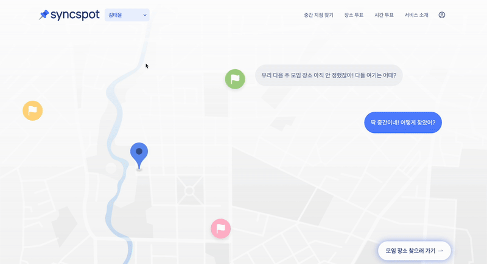
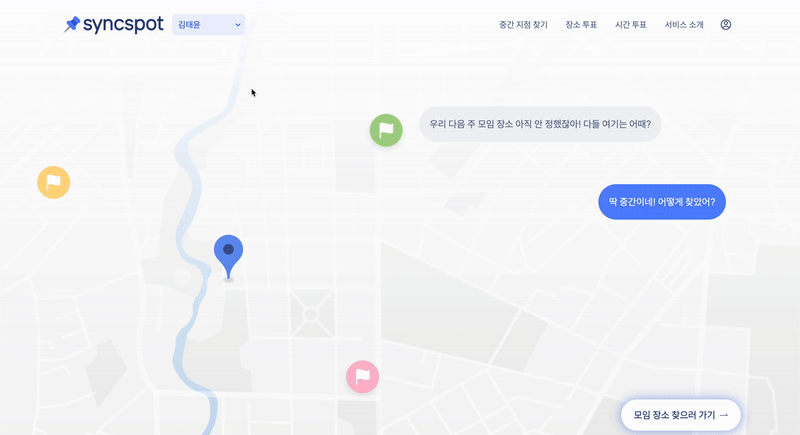

## 🤨 뒤로가기를 눌렀는데 홈 화면으로 간다고?

> 내가 만들고 있던 서비스에는 온보딩 프로세스가 있었다.

해당 온보딩 플로우는 아래와 같이 여러 단계를 거치는 구조였다.

1. 모임을 선택하거나 새로 생성하고
2. 기능을 선택한 후
3. 본격적인 사용으로 진입

<br/>

기존의 경우, 모든 화면은 하나의 URL(PATH.ONBOARDING)에서 렌더링되고 있었으며 각 단계가 React 상태로 관리되고 있었다.

> 하지만 여기서 브라우저의 뒤로가기 버튼을 눌렀을 때 문제가 발생했다.

사용자가 기능 선택 화면에서 "뒤로 가기" 버튼을 누르면, 이전 단계인 모임 선택 화면으로 가야 할 것으로 예상했지만, 실제로는 온보딩 페이지를 클릭하기 전 경로로 이동했다.

그 이유는 다음 또는 이전 버튼을 클릭할때 페이지가 이동하는 것이 아닌 `온보딩 단계`를 저장하고 있는 상태가 변하였고 이에 따라 브라우저 히스토리에 아무 변화도 없었기 때문이었다.

따라서 뒤로가기 버튼을 누르면 이전 단계가 아닌 온보딩 페이지를 클릭하기 전 경로로 이동했던 것이다.

> 뒤로가기가 예상대로 동작하지 않는 기존의 경우

<br/>

그래서 사용자가 브라우저 뒤로 가기를 눌러도, 이전 단계로 돌아갈 수 있도록 만들기 위해 `History API`를 활용해보았다.

## 🔍 History API란?

History API는 웹 애플리케이션에서 사용자의 탐색 기록을 직접 조작할 수 있게 해주는 브라우저의 API이다.

> 주요 메서드는 다음과 같다

1️⃣ `pushState(state, title, url)`

-> 새로운 기록 항목을 스택에 추가한다.

2️⃣ `replaceState(state, title, url)`

-> 현재 기록 항목을 덮어쓴다. 스택의 크기는 변하지 않는다.

3️⃣ `popstate 이벤트`

-> 사용자가 브라우저의 뒤로/앞으로 버튼을 클릭하면 발생하는 이벤트로, 상태를 기반으로 앱의 UI를 조정할 수 있다.

### pushState와 replaceState의 차이

pushState와 replaceState의 차이는 `replaceState`는 주로 같은 페이지에서 상태만 살짝 바꾸고 싶을 때 사용하는 반면, `pushState`는 사용자가 "뒤로가기"로 되돌릴 수 있는 스텝을 추가할 때 사용한다.

## 🎯 `History API`를 사용하기 이전 코드

```javascript
export default function OnBoardingPage() {
  const [step, setStep] = useState(OnboardingStepType.ONBOARDING_PLAN_STEP);

  return (
    <>
      {step === OnboardingStepType.ONBOARDING_PLAN_STEP && (
        <OnBoardingPlan setOnboardingStep={setStep} />
      )}
      {step === OnboardingStepType.ONBOARDING_CREATE_STEP && (
        <OnBoardingCreate setOnboardingStep={setStep} />
      )}
      {step === OnboardingStepType.ONBOARDING_FUNCTION_SELECT_STEP && (
        <OnBoardingFunctionSelect />
      )}
    </>
  );
}
```

이전에는 위와 같이 step 상태에 따라 화면을 조건부 렌더링하였고 각 컴포넌트에서 setStep을 통해 단계를 전환하였다.

하지만 위에서도 말했듯이 브라우저 히스토리에는 아무 변화가 없었고, 따라서 뒤로가기 버튼을 누르면 이전 단계가 아닌, 온보딩 페이지를 클릭하기 전 경로로 이동해버리는 문제가 발생했다.

> 그래서 History API를 통해 아래와 같이 수정하였다.

## 🎯 `History API`를 사용한 온보딩 흐름 구현

```javascript
const handleStepChange = (newStep: keyof typeof OnboardingStepType) => {
  const currentState = {
    onboardingStep: newStep,
    previousStep: onboardingStep,
  };

  // 현재 상태 덮어쓰기 (replace)
  window.history.replaceState(
    {
      onboardingStep,
      previousStep: window.history.state?.previousStep,
    },
    '',
    PATH.ONBOARDING,
  );

  // 새로운 상태 추가 (push)
  window.history.pushState(currentState, '', PATH.ONBOARDING);

  // 상태 반영
  setOnboardingStep(newStep);
};
```

위와 같이 replaceState로 현재 상태를 정확히 기록한 뒤 pushState로 새로운 단계 정보를 추가하였고 마지막으로 React 상태 업데이트하였다.

> 또한 아래와 같이 popstate 이벤트를 통해 브라우저의 뒤로 가기를 감지했다.

```javascript
useEffect(() => {
  const handlePopState = (event: PopStateEvent) => {
    if (event.state === null) {
      window.location.href = PATH.ROOT;
      return;
    }

    setOnboardingStep(event.state.onboardingStep);
  };

  window.addEventListener('popstate', handlePopState);

  if (window.history.state === null) {
    window.history.replaceState(
      {
        onboardingStep,
        previousStep: null,
      },
      '',
      PATH.ONBOARDING
    );
  }

  return () => {
    window.removeEventListener('popstate', handlePopState);
  };
}, [onboardingStep]);
```

브라우저의 뒤로가기 발생 시 popstate 이벤트로 이전 단계로 복원되도록 하였으며, 초기 진입 시에도 replaceState를 통해 초기 상태를 등록 하여 URL을 직접 입력하는 경우에도 대응했다.

> 브라우저 뒤로가기가 잘 작동하는 경우

<br/>

## 😢 기존 온보딩 코드에서 느낀 불편함

결과적으로는 브라우저 뒤로가기가 잘 작동하였지만, 조금 더 개선할 수 있는 부분이 있었다.

> 먼저 기존의 온보딩 코드는 유지보수가 하기 어렵다는 점이 있다.

그 이유는 위 과정에서 새로운 단계를 추가하려면 새로운 컴포넌트를 만들고,
OnboardingStepType에 항목을 추가해야 한다.

뿐만 아니라 조건부 렌더링 로직도 수정해야 했으며 이 모든 수정이 산발적으로 이뤄지니 점점 관리가 힘들어진다는 단점이 있었다.

> 코드 또한 직관적이지 않았다.

단순히 컴포넌트를 조건부 렌더링하는 방식이었기 때문에 흐름을 한눈에 파악하기 어려웠다.

이러한 문제를 해결하기 위해 고민하다가 Toss의 퍼널 패턴을 알게되었고 이를 적용해보고자 했다.

토스의 퍼널 패턴은 [퍼널 패턴 참고 링크](https://www.youtube.com/watch?v=NwLWX2RNVcw)를 참고해보면 좋을 것 같다.

## 🎯 퍼널 패턴과 useFunnel 훅 도입

[toss의 useFunnel 훅 코드](https://github.com/toss/slash/blob/main/packages/react/use-funnel/src/useFunnel.tsx)를 참고하여 아래와 같이 useFunnel 훅을 만들어보았다.

```javascript
export function useFunnel<T>(defaultStep: T) {
  const [step, setStep] = useState<T>(defaultStep);

  const changeStep = (newStep: T) => {
    window.history.replaceState(
      {
        onboardingStep: step,
        previousStep: window.history.state?.previousStep,
      },
      '',
      PATH.ONBOARDING,
    );

    window.history.pushState(
      {
        onboardingStep: newStep,
        previousStep: step,
      },
      '',
      PATH.ONBOARDING,
    );

    setStep(newStep);
  };

  useEffect(() => {
    const handlePopState = (event: PopStateEvent) => {
      if (event.state === null) {
        window.location.href = PATH.ROOT;
        return;
      }
      setStep(event.state.onboardingStep);
    };

    window.addEventListener('popstate', handlePopState);

    if (window.history.state === null) {
      window.history.replaceState(
        { onboardingStep: step, previousStep: null },
        '',
        PATH.ONBOARDING,
      );
    }

    return () => window.removeEventListener('popstate', handlePopState);
  }, [step]);

  function Funnel({ children }: FunnelProps<T>) {
    const currentStepElement = children.find(
      (child) => child.props.step === step,
    );
    return <>{currentStepElement}</>;
  }

  function Step({ children }: StepProps<T>) {
    return <>{children}</>;
  }

  Funnel.Step = Step;

  return {
    Funnel,
    currentStep: step,
    changeStep,
  } as const;
}
```

위와 같이 useFunnel 훅을 만들어 현재 단계에 따라 해당 단계에 맞는 컴포넌트를 렌더링하고, 단계를 전환할 때마다 내부적으로 replaceState와 pushState를 순차적으로 호출해 브라우저의 히스토리 스택을 조작하였다.

또한 사용자가 브라우저의 뒤로 가기 버튼을 누를 경우 popstate 이벤트를 감지해 해당 단계로 UI를 복원하였다.

이렇게 수정된 useFunnel 훅을 사용하여 OnBoardingPage를 다음과 같이 개선하였다.

```javascript
export default function OnBoardingPage() {
  const location = useLocation();
  const initialStep = location.state?.initialStep || OnboardingStepType.PLAN;

  const { Funnel, changeStep } = useFunnel(initialStep);
  const [selectedRoomId, setSelectedRoomId] = useState(null);

  return (
    <Funnel>
      <Funnel.Step step={OnboardingStepType.PLAN}>
        <OnBoardingPlan
          setOnboardingStep={changeStep}
          setSelectedRoomId={setSelectedRoomId}
        />
      </Funnel.Step>

      <Funnel.Step step={OnboardingStepType.CREATE}>
        <OnBoardingCreate
          setOnboardingStep={changeStep}
          setSelectedRoomId={setSelectedRoomId}
        />
      </Funnel.Step>

      <Funnel.Step step={OnboardingStepType.SELECT}>
        <OnBoardingFunctionSelect selectedRoomId={selectedRoomId} />
      </Funnel.Step>
    </Funnel>
  );
}
```

### 🙇🏻 마치며

온보딩 플로우를 단순히 상태로만 관리했을 땐, 브라우저의 뒤로 가기 버튼이 전혀 의도대로 동작하지 않는 게 문제였다.

사용자 입장에선 당연히 이전 단계로 돌아가길 기대하는데, 갑자기 홈 화면으로 튕겨버리니 흐름이 끊겨버렸던 거다.

이 문제를 해결하려고 History API를 활용해 브라우저 히스토리를 직접 다루고, 구조적으로는 퍼널 패턴을 도입해 각 단계를 명확하게 나눠봤다.

결과적으로 뒤로 가기/앞으로 가기 버튼이 자연스럽게 온보딩 흐름을 따라가도록 할 수 있었고, 각 스텝이 컴포넌트로 나뉘면서 코드가 눈에 확 들어오게 되었다.

또한 흐름을 바꾸는 로직이 useFunnel 하나로 모여서 관리도 쉬워졌다.
