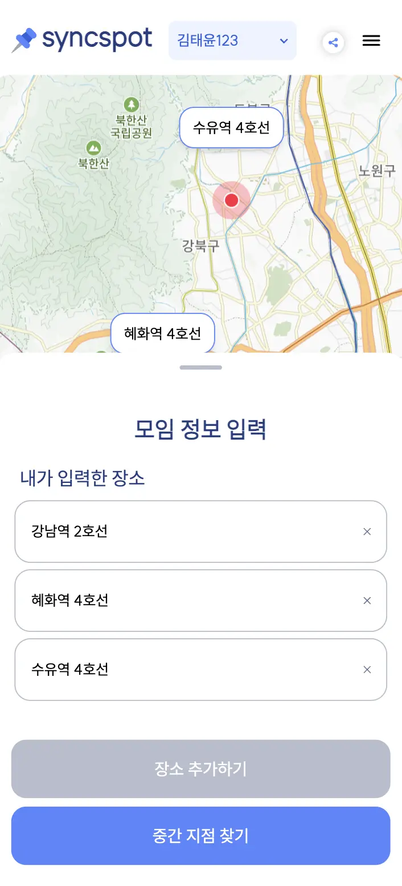
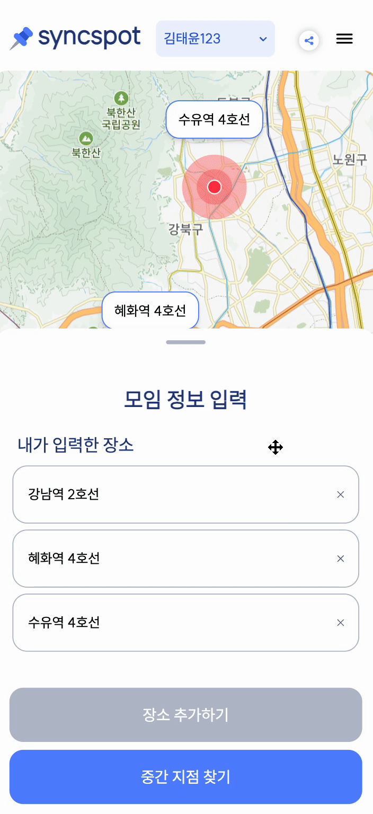

## 🤔 모바일 환경에서는 어떻게 보여주면 좋을까?

> 우리 서비스는 모바일과 데스크톱 환경을 모두 지원하는 반응형 웹 서비스이다.

데스크탑과 달리 모바일 환경은 화면 크기에 제약이 있어, 지도와 같은 메인 콘텐츠와 함께 상세 정보를 어떻게 효과적으로 보여줄지가 큰 고민이었다. 지도와 동시에 장소 목록이나 투표 정보처럼 중요한 정보도 함께 제공해야 했기 때문이다.

데스크톱에서는 화면을 그리드로 나누어 지도와 정보를 나란히 배치하는 것이 가능했지만, 모바일에서는 그런 레이아웃이 불가능했다.

> 그래서 이러한 문제를 해결하고자 바텀시트를 도입하였다.

바텀 시트는 화면 하단에서 위로 끌어올릴 수 있는 패널로, 모바일 앱에서 자주 볼 수 있는 UI 패턴이다. 이 패턴을 사용하면 지도는 배경으로 두고, 사용자가 필요에 따라 정보를 더 많이 또는 적게 볼 수 있도록 조절할 수 있다.

`바텀시트 예시`


<br /> <br/>

> 하지만 React에서 바텀 시트를 구현하는 것은 생각보다 간단하지 않았다.

특히 드래그 제스처 처리, 높이 조절, 그리고 다양한 뷰포트 크기에 대응하는 반응형 동작을 구현하는 것이 까다로웠다.

## 🛠️ 바텀 시트 구현의 여정

바텀 시트를 구현하기 위해 먼저 아래와 같이 요구사항을 명확하게 정리했다.

- 사용자는 손가락으로 자연스럽게 패널을 끌어올리고 내릴 수 있어야 하며, 다양한 화면 크기와 방향에 적응할 수 있어야 한다.
- 바텀시트 내부 콘텐츠는 스크롤이 가능해야 한다.
- 개발자가 필요에 따라 바텀시트의 최소/최대/초기 높이를 설정할 수 있어야 한다.

이러한 요구사항을 충족하기 위해 React의 훅과 DOM 이벤트를 활용한 접근 방식을 선택했다. 먼저 복잡한 로직을 UI 컴포넌트와 분리하기 위해 커스텀 훅인 `useBottomSheet`를 만들었다.

```javascript
export function useBottomSheet({
  minHeight,
  maxHeight,
  initialHeight,
  onHeightChange,
}: UseBottomSheetProps) {
  // dvh를 픽셀로 변환하는 함수
  const dvhToPixels = (dvh: number) => {
    const dvhUnit = window.innerHeight * 0.01;
    return dvh * dvhUnit;
  };

  const [sheetHeight, setSheetHeight] = useState(dvhToPixels(initialHeight));
  const sheetRef = useRef < HTMLDivElement > null;
  const dragHandleRef = useRef < HTMLDivElement > null;
  const startYRef = useRef < number > 0;
  const currentHeightRef = useRef < number > initialHeight;

  // 생략된 코드...

  return {
    sheetRef,
    dragHandleRef,
    sheetHeight,
  };
}
```

위의 useBottomSheet 커스텀 훅은 사용자의 드래그 제스처를 감지하고, 그에 따라 바텀 시트의 높이를 조절하는 역할을 한다. 특히 다양한 디바이스에서 일관된 사용자 경험을 제공하기 위해 모바일과 데스크톱 환경을 모두 고려하여 터치 이벤트와 마우스 이벤트를 함께 처리할 수 있도록 설계했다.

## 🍗 useBottomSheet 훅을 뜯어보자

> 그렇다면, useBottomSheet훅을 어떻게 만들었는지 자세하게 살펴보자.

먼저 아래와 같이 드래그 시작 시, 손가락이나 마우스의 위치를 기록하고 필요한 이벤트 리스너를 등록하였다.

```javascript
const handleDragStart = useCallback(
  (e: MouseEvent | TouchEvent) => {
    startYRef.current = clientY;
    currentHeightRef.current = sheetHeight;

    document.addEventListener('mousemove', handleDrag);
    document.addEventListener('mouseup', handleDragEnd);
    document.addEventListener('touchmove', handleDrag);
    document.addEventListener('touchend', handleDragEnd);
  },
  [sheetHeight]
);
```

또한 'touches' 속성의 존재 여부로 터치 이벤트와 마우스 이벤트를 구분하여 사용자가 이벤트를 시작한 정확한 지점에서부터 드래그를 추적하도록 하였으며 이 과정에서 설정된 최소/최대 높이를 벗어나지 않도록 제한하였다.

```javascript
const handleDrag = useCallback(
  (e: MouseEvent | TouchEvent) => {
    const clientY = 'touches' in e ? e.touches[0].clientY : e.clientY;
    const delta = startYRef.current - clientY;
    const newHeight = currentHeightRef.current + delta;

    if (newHeight < dvhToPixels(minHeight)) {
      setSheetHeight(dvhToPixels(minHeight));
    } else if (newHeight > dvhToPixels(maxHeight)) {
      setSheetHeight(dvhToPixels(maxHeight));
    } else {
      setSheetHeight(newHeight);
    }
  },
  [minHeight, maxHeight]
);
```

끝으로, 드래그가 끝나면 등록된 이벤트 리스너를 제거하여 메모리 누수를 방지하도록 하였다.

```javascript
const handleDragEnd = useCallback(() => {
  document.removeEventListener('mousemove', handleDrag);
  document.removeEventListener('mouseup', handleDragEnd);
  document.removeEventListener('touchmove', handleDrag);
  document.removeEventListener('touchend', handleDragEnd);
}, [handleDrag]);
```

이렇게 구현된 훅을 바탕으로, 실제 바텀 시트 컴포넌트(BottomSheet)를 아래와 같이 만들었다.

### `BottomSheet.tsx`

```javascript
export default function BottomSheet({
  children,
  minHeight = 30,
  maxHeight = 90,
  initialHeight = 50,
  headerHeight = 32,
  onHeightChange,
  isTime = false,
}: BottomSheetProps) {
  const { sheetRef, dragHandleRef, sheetHeight } = useBottomSheet({
    minHeight,
    maxHeight,
    initialHeight,
    headerHeight,
    onHeightChange,
  });

  // vh를 dvh로 변환
  const heightStyle = `${(sheetHeight / window.innerHeight) * 100}dvh`;

  return (
    <>
      <div
        ref={sheetRef}
        className={`fixed bottom-0 left-0 right-0 ${
          isTime ? 'bg-gray-light' : 'bg-white-default'
        }  rounded-t-[1.25rem] shadow-lg transition-transform z-50 lg:hidden`}
        style={{
          height: heightStyle,
          touchAction: 'none',
        }}
      >
        <div
          ref={dragHandleRef}
          className="flex justify-center w-full pt-3 pb-5 cursor-grab active:cursor-grabbing"
          style={{ height: `${(headerHeight / window.innerHeight) * 100}dvh` }}
        >
          <div className="w-10 h-1 rounded-full bg-gray-normal" />
        </div>
        <div
          className="overflow-y-auto"
          style={{
            height: `calc(100% - ${
              (headerHeight / window.innerHeight) * 100
            }dvh)`,
          }}
        >
          {children}
        </div>
      </div>
    </>
  );
}
```

위의 바텀시트 컴포넌트는 시각적으로 세 부분으로 나눌 수 있다.

먼저 전체를 감싸는 `컨테이너`가 있다. 이 컨테이너는 화면 하단에 고정되어 있으며, 사용자의 드래그에 따라 높이가 변한다.

상단에는 사용자가 드래그할 수 있는 `핸들`이 있으며, 이 핸들을 통해 바텀 시트의 높이를 조절할 수 있다.

마지막으로 핸들 아래에는 `실제 콘텐츠가 표시되는 영역`이 있으며, 이 영역은 내용이 많을 경우 스크롤이 가능하다.

또한, 구현 과정에서 dvh 단위를 사용하여 모바일 브라우저에서 주소창 등의 UI 요소가 표시되는 상황을 고려하여 실제 가용 화면 높이를 더 정확하게 계산하도록 하였다.

## 📱 바텀시트 사용 예시

> 이제 위에서 구현한 바텀시트가 어떻게 사용되고 있는지 살펴보자

위에서 구현한 바텀시트는 주로 지도와 함께 정보를 표시해야 하는 화면에서 사용되었다.

> 먼저 위치 정보 입력화면에서의 사용을 확인해보자.

`위치 정보 입력 화면`에서는 사용자가 자신의 위치와 친구들의 위치 정보를 모두 볼 수 있도록 바텀 시트의 초기 높이를 60%로 설정했다. 이렇게 하면 지도도 볼 수 있으면서 동시에 충분한 정보도 표시할 수 있었다.

```javascript
<BottomSheet
  minHeight={60}
  maxHeight={90}
  initialHeight={60}
  headerHeight={40}
  onHeightChange={(height) => setBottomSheetHeight(height)}
>
  {/* 내용 */}
</BottomSheet>
```

또한 바텀 시트의 높이가 변할 때마다 호출되는 onHeightChange 콜백을 활용해 내부 스크롤 영역의 높이를 동적으로 조정했다. 이는 바텀 시트가 높아질수록 더 많은 정보를 한 번에 볼 수 있도록 하기 위함이었다.

```javascript
const getScrollAreaStyle = (bottomSheetHeight: number) => {
  const viewportHeight = window.innerHeight;
  const threshold = viewportHeight * 0.7;

  if (bottomSheetHeight <= threshold) {
    return 'max-h-[calc(100dvh-30rem)] overflow-y-auto';
  } else {
    return 'max-h-[calc(100dvh-7rem)] overflow-y-auto';
  }
};
```

`장소 추천 화면`에서는 지도가 주요 콘텐츠였기 때문에, 바텀 시트의 최소 높이를 10%로 낮게 설정했다. 이렇게 하면 사용자가 필요에 따라 추천 장소 목록을 확인할 수 있으면서도, 원할 때는 바텀 시트를 최소화하여 지도에 집중할 수 있다.

```javascript
<BottomSheet minHeight={10} maxHeight={72} initialHeight={50}>
  {/* 내용 */}
</BottomSheet>
```

`바텀 시트가 적용된 화면`




## 🚀 성능을 고려한 설계

바텀 시트는 드래그 제스처와 애니메이션이 많이 발생하는 컴포넌트이기 때문에 성능 최적화가 매우 중요하다고 생각했다. 특히 모바일 환경에서는 작은 지연이나 끊김도 사용자 경험에 큰 영향을 미칠 수 있다고 생각했기에 더 신경을 써서 설계했다.

React의 렌더링 특성상, 상태 변경이 있을 때마다 컴포넌트가 리렌더링된다. 드래그와 같이 빈번한 이벤트가 발생하는 상황에서는 이러한 리렌더링이 성능 저하로 이어질 수 있다고 판단했다.

> 따라서 이를 방지하기 위해 몇 가지 최적화 기법을 적용했다.

먼저, 아래와 같이 useCallback을 사용하여 이벤트 핸들러 함수를 메모이제이션했다. 이를 통해 컴포넌트가 리렌더링될 때마다 함수가 새로 생성되는 것을 방지하여 불필요한 메모리 사용을 줄이고자 했다.

```javascript
const handleDrag = useCallback(
  (e: MouseEvent | TouchEvent) => {
    const clientY = 'touches' in e ? e.touches[0].clientY : e.clientY;
    const delta = startYRef.current - clientY;
    const newHeight = currentHeightRef.current + delta;

    if (newHeight < dvhToPixels(minHeight)) {
      setSheetHeight(dvhToPixels(minHeight));
    } else if (newHeight > dvhToPixels(maxHeight)) {
      setSheetHeight(dvhToPixels(maxHeight));
    } else {
      setSheetHeight(newHeight);
    }
  },
  [minHeight, maxHeight]
);
```

위 함수는 바텀 시트를 드래그할 때 호출되어 높이를 조절하는 핵심 로직이다. 여기서 `setSheetHeight`가 호출될 때마다 React는 컴포넌트를 리렌더링하게 된다. 개발 초기에는 단순히 이 함수를 컴포넌트 내부에 선언했었는데, 테스트 과정에서 성능 문제가 발생했다.

리렌더링이 발생할 때마다 컴포넌트 내부의 함수들이 모두 새로 생성된다는 React의 특성 때문에, 드래그 중에 초당 수십 번씩 새로운 함수가 생성되는 문제가 있었다. 이는 두 가지 측면에서 좋지 않았다.

첫째, 메모리 사용 측면에서 비효율적이었다. 드래그 하는 동안 계속해서 새로운 함수 객체가 생성되고 가비지 컬렉션의 대상이 되기 때문에, 특히 저사양 모바일 기기에서는 눈에 띄는 성능 저하가 발생했다.

둘째, 더 심각한 문제는 이벤트 리스너 관리에 있었다. 드래그를 시작할 때 다음과 같이 전역 이벤트 리스너를 등록했다.

```javascript
const handleDragStart = useCallback(
  (e: MouseEvent | TouchEvent) => {
    startYRef.current = clientY;
    currentHeightRef.current = sheetHeight;

    document.addEventListener('mousemove', handleDrag);
    document.addEventListener('mouseup', handleDragEnd);
    document.addEventListener('touchmove', handleDrag);
    document.addEventListener('touchend', handleDragEnd);
  },
  [sheetHeight]
);

const handleDragEnd = useCallback(() => {
  document.removeEventListener('mousemove', handleDrag);
  document.removeEventListener('mouseup', handleDragEnd);
  document.removeEventListener('touchmove', handleDrag);
  document.removeEventListener('touchend', handleDragEnd);
}, [handleDrag]);
```

여기서 문제는 useCallback 없이 구현했을 때, 드래그 중 리렌더링이 발생할 때마다 `handleDrag`가 새로운 함수 객체로 생성된다는 점이다. JavaScript에서 이벤트 리스너는 함수의 참조 동등성을 기준으로 식별되기 때문에, `handleDragEnd`에서 이벤트를 제거하려고 해도 원래 등록했던 함수와 다른 객체라서 제대로 제거되지 않았다.

테스트 중에 이 문제를 발견했을 때는 당황스러웠다. 사용자가 바텀 시트를 여러 번 드래그할수록 제거되지 않은 이벤트 리스너가 계속 누적되고, 결국 같은 드래그 동작에 여러 핸들러가 반응하는 이상 현상이 나타났다. 이는 메모리 누수뿐만 아니라 잘못된 동작으로 이어지고 있었다.

이 문제를 해결하기 위해 useCallback을 적용했고, 종속성 배열을 [minHeight, maxHeight]로 설정했다. 이렇게 하면 이 두 값이 변경되지 않는 한 항상 동일한 함수 인스턴스가 유지되므로, 이벤트 리스너의 등록과 제거가 정확히 이루어질 수 있었다.

## 🌈 useRef로 불필요한 상태 업데이트 방지하기

드래그 기능을 최적화하는 과정에서는 드래그 상태를 추적하는 변수들에 useState 대신 useRef를 사용했다.

```javascript
const startYRef = useRef < number > 0;
const currentHeightRef = useRef < number > initialHeight;
```

처음에는 단순히 state를 사용해 드래그 위치를 추적하려고 했다. 하지만 React Profiler를 통해 확인해본 결과, 드래그하는 동안 손가락 위치와 현재 시트 높이가 계속 변하면서 상태 업데이트가 연쇄적으로 발생했고, 이는 불필요한 리렌더링을 발생시켰다.

useRef의 가장 큰 장점은 값이 변경되어도 리렌더링을 유발하지 않는다는 것이다. 따라서 드래그 중간 과정에서는 useRef로 상태를 관리하고, 최종적으로 바텀 시트의 높이가 결정되었을 때만 setSheetHeight를 호출하여 실제 UI를 업데이트하도록 설계했다.

> 이러한 최적화 작업 덕분에 부드러운 드래그 경험을 제공할 수 있었다.

특히 성능 테스트 중에 구형 안드로이드 기기에서도 바텀 시트가 부드럽게 움직이는 것을 보았을 때 뿌듯함을 느꼈다. 사용자 인터랙션이 많은 UI 컴포넌트를 개발할 때는 단순히 '작동하게 만드는 것'을 넘어서, 어떻게 하면 더 자연스럽고 부드러운 경험을 제공할 수 있을지 고민하는 것이 중요하다는 걸 다시 한번 깨달았다.

## 🔄 미래를 위한 확장성 고려

현재 바텀 시트 구현은 기본적인 요구사항을 충족하지만, 더 나은 사용자 경험을 위해 몇 가지 개선 사항을 고려하고 있다.

첫번째로 스냅 포인트 기능을 추가하는 것이다. 현재는 사용자가 드래그를 멈춘 위치에 바텀 시트가 그대로 멈추지만, 아래와 같이 미리 정의된 특정 높이(예: 30%, 50%, 80%)에 자동으로 스냅되도록 개선할 수 있을 것 같다.

```javascript
const handleDragEnd = useCallback(() => {
  // 이벤트 리스너 제거
  document.removeEventListener('mousemove', handleDrag);
  document.removeEventListener('mouseup', handleDragEnd);
  document.removeEventListener('touchmove', handleDrag);
  document.removeEventListener('touchend', handleDragEnd);

  // 가장 가까운 스냅 포인트 계산
  const snapPoints = [
    dvhToPixels(minHeight),
    dvhToPixels((minHeight + maxHeight) / 2),
    dvhToPixels(maxHeight),
  ];

  const closestSnapPoint = snapPoints.reduce((prev, curr) =>
    Math.abs(curr - sheetHeight) < Math.abs(prev - sheetHeight) ? curr : prev
  );

  // 스냅 포인트로 애니메이션 이동
  setSheetHeight(closestSnapPoint);
}, [handleDrag, sheetHeight, minHeight, maxHeight]);
```

두번째로는 스와이프 다운으로 바텀 시트를 완전히 닫을 수 있는 기능을 추가하는 것이다. 사용자가 바텀 시트를 최소 높이 이하로 스와이프 다운하면 시트가 완전히 사라지도록 하여 더 자연스럽게 만들면 좋을 것 같다.

마지막으로 드래그 속도에 따른 관성 스크롤을 추가할 수 있을 것 같다. 현재는 사용자가 드래그를 멈추면 바텀 시트도 즉시 멈추지만, 드래그 속도에 따라 일정 거리를 더 움직이게 하면 더 자연스러운 느낌을 줄 수 있을 것 같다고 생각했다.

따라서 이를 위해 드래그 중 속도를 계산하고, 드래그가 끝났을 때 그 속도에 비례해 추가 움직임을 적용하여 개선할 수 있을 것 같다.

## 🙇‍♂️ 마치며

바텀 시트 컴포넌트를 구현하면서 많은 고민과 시행착오가 있었다. 사용자 제스처 처리, 반응형 레이아웃, 성능 최적화 등 여러 도전 과제를 해결해나가는 과정은 쉽지 않았지만, 결과적으로 사용자에게 직관적이고 유연한 인터페이스를 제공할 수 있게 되었다.

또, useBottomSheet 훅으로 복잡한 드래그 로직을 캡슐화하고 바텀 시트 컴포넌트는 UI 표현에만 집중하도록 하여 컴포넌트와 로직을 분리하였고 이를 통해 코드의 가독성과 유지보수성을 크게 향상시킬 수 있는 좋은 경험이었다.
