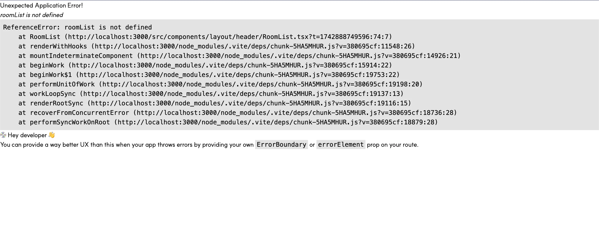
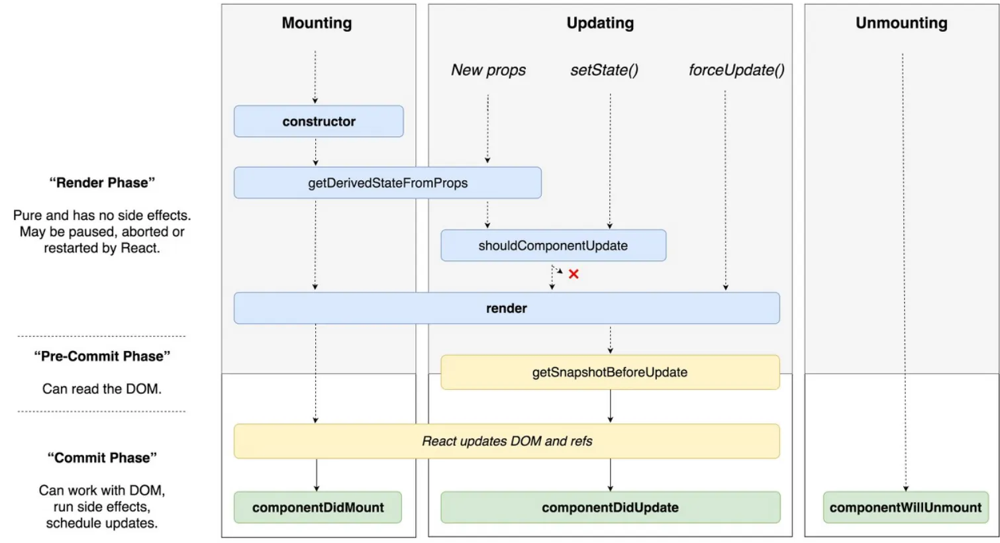
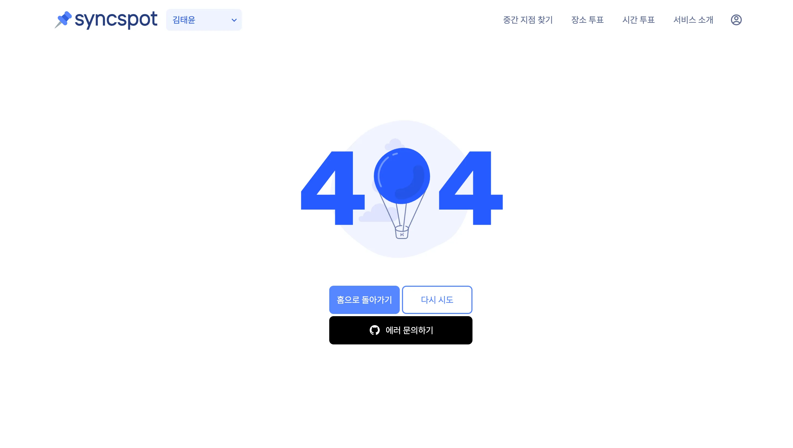

프론트엔드 개발을 하면서 한번 쯤은 아래와 같은 에러 화면을 본 적이 있을 것이다.



개발자인 나의 입장에서 개발 과정중에 해당 화면을 보게될 경우 "어? 에러화면이네, 이와 관련된 파일을 찾아 해결해야겠다" 라고 생각할 것이다.

> 하지만 만약 배포된 사이트에서 일반 사용자가 위와 같은 에러 화면을 보게된다면 어떨까?

개발자가 아닌 일반 사용자가 위 에러 화면을 본다면 "이게 뭐지?" 싶을 것이다. 최악의 경우에는 해당 화면을 보고 사이트를 떠날 수도 있을 것 같다.

따라서 올바른 에러 처리는 개발자 경험(DX) 뿐만 아니라 좋은 사용자 경험(UX)을 위해 중요하다.

> 그렇다면 에러는 언제 많이 발생할까?

개발 과정에서 에러가 발생하는 상황은 다양하지만 가장 흔하게 발생하는 상황은 아무래도 비동기 호출을 진행할 때인 것 같다.

기존의 경우, 비동기 호출을 진행할때에 try, catch를 이용하여 코드를 짜주었다. 하지만 이 과정에서 다음과 같은 불편함이 있었다.

- 새로운 에러가 추가될때마다 catch문안에 코드를 추가해주어야 함.
- 에러 핸들링에 대한 명확한 기준이 없다면 개발자마다 다른 에러 핸들링으로 코드의 통일성을 잃어버릴 수 있음.
- 비동기 호출을 진행할때에 try, catch를 이용하여 코드를 짜주었기 때문에 비동기 호출을 진행할때에는 명령형으로 처리되어야 하는 부분이 있음.

특히 마지막의 try,catch를 이용하여 명령형으로 에러를 처리하는 점이 React의 컴포넌트는 선언적이고 무엇을 렌더링할지 구체화한다는 특징과 맞지 않아서 큰 불편함을 느꼈다. (실제로 개발과정에서 백엔드로부터 에러코드가 하나 추가되어 이에 대한 별도의 처리를 해줘야 했던 적이 있었다. 이때 해당 비동기 호출과 관련이 있는 모든 파일을 하나하나 찾아가서 코드를 수정한 경험이 있다.)

따라서 컴포넌트 작성시에는 비동기 호출이 성공되었을 때의 로직에만 집중하고 비동기 호출 과정에서 발생하는 에러는 이와 분리해서 처리해줄 수 없을까?에 대해 고민해보았고 이 과정에서 `Error Boundary` 라는 개념을 알게 되었다.

## Error Boundary

`Error Boundary` 는 React 16 버전부터 도입된 개념이다.ErrorBoundary라는 이름처럼 에러를 어떠한 경계 안에 가두고 기존 컴포넌트 대신 fallback UI를 보여주는 역할을 한다.

> 그렇다면 에러를 어떠한 경계안에 가둔다는 것이 무슨 의미일까?

이는 하위 컴포넌트 트리에서 발생한 에러를 잡아서 선언적으로 처리한다는 것을 의미한다.

아래 [React 공식문서](https://ko.legacy.reactjs.org/docs/error-boundaries.html)에서 Error Boundary의 코드를 통해 조금 더 살펴보자.

```javascript
class ErrorBoundary extends React.Component {
  constructor(props) {
    super(props);
    this.state = { hasError: false };
  }

  static getDerivedStateFromError(error) {
    // 다음 렌더링에서 폴백 UI가 보이도록 상태를 업데이트 합니다.
    return { hasError: true };
  }

  componentDidCatch(error, errorInfo) {
    // 에러 리포팅 서비스에 에러를 기록할 수도 있습니다.
    logErrorToMyService(error, errorInfo);
  }

  render() {
    if (this.state.hasError) {
      // 폴백 UI를 커스텀하여 렌더링할 수 있습니다.
      return <h1>Something went wrong.</h1>;
    }

    return this.props.children;
  }
}
```

위에서 정의된 함수의 역할에 대해 살펴보면 다음과 같다.

## static getDerivedStateFromError(error)

해당 함수는 하위 컴포넌트에서 발생한 에러를 감지하고, 상태 업데이트를 통해 에러 발생 여부를 컴포넌트 상태에 반영하는 역할을 한다. (에러가 발생하면 이 메서드가 호출되어 hasError 상태를 true로 변경한다.)

주의할 점은 에러를 throw 받은 시점인 render 단계에서 호출되기 때문에 side effects를 발생시키면 안된다!

## componentDidCatch(error, errorInfo)

해당 함수는 컴포넌트에서 발생한 에러를 캐치하고 처리하는 역할을 한다. 이 함수는 커밋 단계에서 호출되며, 주로 사이드 이펙트가 발생되는 작업을 처리한다는 특징이 있다.

에러 발생 시 호출되며, error 매개변수로 발생한 에러 객체, errorInfo 매개변수로 에러 정보를 전달받는다. (일반적으로 여기에서는 에러를 로깅하거나 서비스에 에러 정보를 보고하는 로직을 구현한다.)

### React LifeCycle



위의 React LifeCycle에서 확인할 수 있듯이 호출 순서는 getDerivedStateFromError -> render -> componentDidCatch 순으로 호출된다. 이렇듯 ErrorBoundary는 class 컴포넌트의 생명주기 메서드를 이용하여 에러를 catch하기 때문에 class 컴포넌트로만 구현할 수 있다는 특징이 있다.

> ErrorBoundary가 모든 에러를 포착하는 것은 아니다!

- 이벤트 핸들러
- 비동기적 코드 (예: setTimeout 혹은 requestAnimationFrame 콜백)
- 서버 사이드 렌더링
- 자식에서가 아닌 에러 경계 자체에서 발생하는 에러

ErrorBoundary라 하더라도 모든 에러를 포착할 수 있는 것은 아니다.공식문서에 따르면 ErrorBoundary는 위의 에러들을 포착할 수 없다.

그 이유는 fetch, Promise.then, setTimeout 등의 비동기 작업은 브라우저의 Web API 영역에서 먼저 처리되며, 해당 작업이 완료되면 콜백 함수는 큐에 등록되고, 이후 이벤트 루프가 이를 감지해 콜스택으로 전달하여 실행하는데
이 시점에서 에러는 React 렌더링 흐름(Fiber 트리) 밖이므로 감지할 수 없기 때문이다.

따라서 이러한 부분에 대해서는 try,catch를 이용하여 처리해주는 것이 좋다.
(아래는 React 공식문서에서 나온 예시임)

```javascript
class MyComponent extends React.Component {
  constructor(props) {
    super(props);
    this.state = { error: null };
    this.handleClick = this.handleClick.bind(this);
  }

  handleClick() {
    try {
      // 에러를 던질 수 있는 무언가를 해야합니다.
    } catch (error) {
      this.setState({ error });
    }
  }

  render() {
    if (this.state.error) {
      return <h1>Caught an error.</h1>;
    }
    return <button onClick={this.handleClick}>Click Me</button>;
  }
}
```

### 그렇다면 ErrorBoundary를 이용하여 어떻게 에러를 처리해줄 수 있을까?

위의 ErrorBoundary의 코드에 추가적인 기능을 붙여 에러를 처리해줄 수도 있겠지만, 함수형 컴포넌트에서 편리하게 사용할 수 있는 [react-error-boundary](https://github.com/bvaughn/react-error-boundary)가 있어 이를 적용해보았다.

react-error-boundary의 경우 아래와 같이 `FallbackComponent`에 에러가 발생했을때 보여주고자하는 컴포넌트를 넣어주면 된다. (자세한 사용방법은 [공식문서](https://www.npmjs.com/package/react-error-boundary)를 참고)

```javascript
export const App = () => {
  return (
    <ErrorBoundary FallbackComponent={ErrorFallback}>
      <Component />
    </ErrorBoundary>
  );
};

export const ErrorFallback = ({ error, resetErrorBoundary }: FallbackProps) => {
  // 에러처리...
};
```

나의 경우 에러를 처리하는 과정을 아래와 같이 설계해주었다.

```javascript
<UnknownErrorBoundary>
  <APIErrorBoundary>
    <Suspense fallback={<GlobalLoading />}>
      <Outlet />
    </Suspense>
  </APIErrorBoundary>
</UnknownErrorBoundary>
```

위와 같이 먼저 APIErrorBoundary를 통해 백엔드에서 정의한 에러, 네트워크 에러, 요청시간 초과에러 등을 처리해주도록 했다. 더 나아가 APIErrorBoundary를 통해 에러가 잡히지 않았을 경우에는 에러를 상위로 넘겨 UnknownErrorBoundary에서 처리해줄 수 있도록 설계하였다.

그 후, 백엔드에서 정의된 에러코드, 네트워크 에러, 요청시간 초과에러에 대해서 아래 `getErrorData` 함수를 통해 확인할 수 있도록 하였다. (백엔드에서 에러 코드가 추가된다면 getErrorData.ts 파일에 에레코드를 추가해주면 된다.)

`getErrorData.ts`

```javascript
import { AxiosError } from 'axios';

type ErrorCodeType = {
  [key: string]: { status: string; message: string };
};

const ERROR_CODE: ErrorCodeType = {
  // 백엔드에서 정의한 에러
  'C-101': {
    status: '401',
    message: '인증에 실패하였습니다.',
  },
  'A-003': {
    status: '401',
    message: 'Refresh Token이 만료되었습니다.',
  },
  'A-004': {
    status: '402',
    message: 'Access Token을 재발급해야합니다.',
  },
  ...

  // axios 에러
  ERR_NETWORK: {
    status: '네트워크 에러',
    message:
      '서버가 응답하지 않습니다. \n프로그램을 재시작하거나 관리자에게 연락하세요.',
  },
  ECONNABORTED: {
    status: '요청 시간 초과',
    message: '요청 시간을 초과했습니다.',
  },

  // 알 수 없는 에러
  UNKNOWN: { status: 'ERROR', message: '알 수 없는 오류가 발생했습니다.' },
} as const;

export const getErrorData = (
  error: AxiosError<{
    status: number;
    error: string;
    code: string;
    reason: string[];
  }>,
) => {
  const serverErrorCode = error?.response?.data?.code ?? '';
  const axiosErrorCode = error?.code ?? '';

  if (serverErrorCode === 'C-202') {
    return {
      status: '400',
      message:
        error?.response?.data?.reason[0] ?? '요청 파라미터가 잘못되었습니다.',
    };
  } else if (serverErrorCode in ERROR_CODE) {
    return ERROR_CODE[serverErrorCode as keyof typeof ERROR_CODE];
  } else if (axiosErrorCode in ERROR_CODE) {
    return ERROR_CODE[axiosErrorCode as keyof typeof ERROR_CODE];
  } else return ERROR_CODE.UNKNOWN;
};
```

마지막으로 getErrorData 함수를 반환받은 에러 정보들을 바탕으로 ErrorPage 컴포넌트에 전달해주어 사용자에게 어떠한 에러인지 확인할 수 있도록 하였다.

`ErrorPage.tsx`

```javascript
import Layout from '@src/components/layout/Layout';
import Lottie from 'lottie-react';
import Lottie404 from '@src/assets/lotties/Lottie404.json';
import { PATH } from '@src/constants/path';
import { Link } from 'react-router-dom';
import { useEffect } from 'react';
import CustomToast from '@src/components/common/toast/customToast';
import { TOAST_TYPE } from '@src/types/toastType';
import IconGithub from '@src/assets/icons/IconGithub.png';

interface IErrorPageProps {
  status: string;
  message: string;
  isUnknownError: boolean;
  onRetry: () => void;
}

const ErrorPage = ({
  status = 'ERROR',
  message = '알 수 없는 오류가 발생했습니다.',
  isUnknownError = true,
  onRetry,
}: IErrorPageProps) => {
  const handleHomeClick = () => {
    onRetry();
    if (isUnknownError) {
      localStorage.clear();
    }
    window.location.href = PATH.ROOT;
  };

  useEffect(() => {
    CustomToast({
      type: TOAST_TYPE.ERROR,
      status,
      message,
    });
  }, []);

  return (
    <Layout>
      <div
        className={`flex flex-col gap-2 items-center justify-center h-[calc(100dvh-20rem)] ${
          !isUnknownError ? 'mt-16' : 'mt-14'
        }`}
      >
        <Lottie animationData={Lottie404} className="size-52 lg:size-96" />
        <div className="grid grid-cols-2 gap-2 lg:-mt-5">
          <button
            onClick={handleHomeClick}
            className="p-2 rounded-md lg:p-3 bg-blue-normal01 ring-2 ring-blue-normal01 hover:ring-blue-normal02 text-white-default hover:bg-blue-normal02 text-description lg:text-content"
          >
            홈으로 돌아가기
          </button>
          {!isUnknownError ? (
            <button className="p-2 rounded-md lg:p-3 bg-white-default ring-2 ring-blue-normal01 text-blue-normal01 text-description lg:text-content">
              다시 시도
            </button>
          ) : (
            ...
          )}
          ../
        </div>
      </div>
    </Layout>
  );
};

export default ErrorPage;
```

이 과정에서 아래의 두가지 상황으로 분류하여 에러 동작을 고민해봤다.

- 데이터를 받아오는 과정에서 에러가 발생했을 경우
- 사용자가 클릭과 같은 상호작용을 통해 서버와 통신하는 경우

결과적으로 get요청을 통해 데이터를 받아와 화면에 표현하는 과정에서 에러가 발생했을 경우에는 대체 UI를 표시하도록 하였고, 사용자가 클릭과 같은 상호작용을 통해 서버와 통신하는 경우에는 토스트 메세지로 에러를 알리도록 하였다.

그 이유는 데이터를 받아오는 과정에서 에러가 발생해 데이터를 받지 못했을 경우에는 빈 화면을 표시하는 것보단 사용자에게 에러가 발생했음을 알리는 역할을 하는 것이 적절하다고 판단하였고, 버튼을 눌러 서버로 요청을 보내는 과정에서 에러가 발생하는 경우에는 에러 화면이 나오는 것 보다는 토스트 메세지로 알리는 것이 적절하다고 판단하였기 때문이다. (로그인을 하려고 아이디와 비밀번호를 다치고 로그인 버튼을 눌렀을때 에러가 발생하여 에러 페이지를 보여주는 것 보다는 에러 상황을 사용자에게 토스트 메세지로 알리는 것이 합리적이라고 생각했다.)

따라서 아래와 같이 옵션을 설정하여 queryClient를 생성해주었고 QueryClientProvider의 client 옵션에 전달해주었다. (참고로 나는 데이터 캐시와 서버 상태를 선언적으로 처리하기 위해 react-query를 사용하고 있다. 이 부분은 나중에 정리해볼 예정)

```javascript
const queryClient = new QueryClient({
  defaultOptions: {
    queries: {
      retry: 0,
      throwOnError: true,
    },
    mutations: {
      onError: (error: any) => {
        const errorData = getErrorData(error);
        CustomToast({
          type: TOAST_TYPE.ERROR,
          status: errorData.status,
          message: errorData.message,
        });
      },
    },
  },
});
```

다음으로 아래와 같이 `APIErrorBoundary.tsx`와 `APIErrorFallback.tsx`의 코드를 짜주었다.

`APIErrorBoundary.tsx`

```javascript
import { ErrorBoundary } from 'react-error-boundary';
import { APIErrorFallback } from './APIErrorFallback';
import { useQueryErrorResetBoundary } from '@tanstack/react-query';

export const APIErrorBoundary = ({
  children,
}: {
  children: React.ReactNode,
}) => {
  const { reset } = useQueryErrorResetBoundary();

  return (
    <ErrorBoundary FallbackComponent={APIErrorFallback} onReset={reset}>
      {children}
    </ErrorBoundary>
  );
};
```

`APIErrorFallback.tsx`

```javascript
import { FallbackProps } from 'react-error-boundary';
import { isAxiosError } from 'axios';
import { getErrorData } from '@src/utils/getErrorData';
import ErrorPage from '@src/pages/error/ErrorPage';
import { Navigate } from 'react-router-dom';
import { PATH } from '@src/constants/path';

export const APIErrorFallback = ({
  error,
  resetErrorBoundary,
}: FallbackProps) => {
  if (isAxiosError(error)) {
    const errorData = getErrorData(error);

    if (error.response?.data?.code === 'A-003') {
      localStorage.clear();
      window.location.href = PATH.ROOT;
      return;
    }

    if (errorData.status === '401') {
      return <Navigate to={PATH.SIGN_IN} replace />;
    }

    return (
      <ErrorPage
        status={errorData?.status}
        message={errorData?.message}
        isUnknownError={errorData?.status === 'ERROR'}
        onRetry={resetErrorBoundary}
      />
    );
  } else {
    throw error;
  }
};
```

> 자 이제 에러가 발생하는 경우에 어떻게 진행되는 지 살펴보자.

먼저, 에러가 발생했을때 APIErrorBoundary의 FallbackComponent 컴포넌트인 `APIErrorFallback`가 보여지게 된다.

그 후 `APIErrorFallback.tsx`에서는 getErrorData함수를 통해 발생한 에러가 백엔드에서 정의한 에러, 네트워크에러, 요청시간 초과에러 등인지 확인하고 이를 ErrorPage 컴포넌트에 전달해준다.

(만약 여기서 발생한 에러가 위의 3개에 잡히지 않는 다면 해당 에러를 상위로 보내지게 되고 UnknownErrorBoundary에서 처리가 된다.)

최종적으로 사용자는 다음과 같은 에러화면을 보게 된다.



(위는 비동기 요청 과정에서 에러가 발생했을 때 보이는 화면이다)

> 그렇다면 비동기 요청과정에서 에러를 상위로 넘겨주는 과정은 어떻게 진행해주었을까?

나의 경우 아래와 같이 비동기 요청을 진행해주었다.

먼저 getAPIResponseData함수를 만들었다. 이 함수는 비동기 요청을 진행하고 요청 결과를 반환해주는 함수이다. try catch 구문을 사용하여 에러가 발생했을 경우 에러를 상위로 넘겨주도록 하였다.

`getAPIResponseData.ts`

```javascript
import { instance } from '@src/apis/instance';
import { AxiosError, AxiosRequestConfig } from 'axios';

const getAPIResponseData = async <T, D = T>(option: AxiosRequestConfig<D>) => {
  try {
    const { data } = (await instance) < T > option;
    return data;
  } catch (e) {
    throw e;
  }
};

export default getAPIResponseData;
```

그 후 모든 비동기 요청에서 getAPIResponseData함수를 사용하여 요청을 진행하도록 하였다.

아래는 이메일 인증과 관련이 있는 postConfirmEmailVerification, useConfirmEmailVerificationMutation 함수이다.

`postConfirmEmailVerification.ts`

```javascript
import getAPIResponseData from '@src/utils/getAPIResponseData';
import { API } from '@src/constants/api';
import {
  ISignUpConfirmEmailVerificationResponseType,
  ISignUpConfirmEmailVerificationType,
} from '@src/types/auth/SignUpVerificationType';

export const postConfirmEmailVerification = async (
  confirmEmailVerificationPayload: ISignUpConfirmEmailVerificationType
) => {
  return (
    getAPIResponseData < ISignUpConfirmEmailVerificationResponseType,
    ISignUpConfirmEmailVerificationType >
      {
        url: API.SIGN_UP_CONFIRM_EMAIL_VERIFICATION,
        method: 'POST',
        data: confirmEmailVerificationPayload,
      }
  );
};
```

`useConfirmEmailVerificationMutation.ts`

```javascript
import { postConfirmEmailVerification } from '@src/apis/auth/postConfirmEmailVerification';
import {
  ISignUpConfirmEmailVerificationResponseType,
  ISignUpConfirmEmailVerificationType,
} from '@src/types/auth/SignUpVerificationType';
import { useMutation, UseMutationOptions } from '@tanstack/react-query';

export const useConfirmEmailVerificationMutation = (
  options?: UseMutationOptions<
    ISignUpConfirmEmailVerificationResponseType,
    Error,
    ISignUpConfirmEmailVerificationType
  >
) => {
  return useMutation({
    mutationFn: postConfirmEmailVerification,
    ...options,
  });
};
```

위 코드에서 `postConfirmEmailVerification.ts`는 getAPIResponseData함수를 사용하여 url과 method를 전달하고 요청 결과를 반환하고 있다.

`useConfirmEmailVerificationMutation.ts`에서는 앞서 선언한 postConfirmEmailVerification함수를 mutationFn에 넣어 useMutation를 반환하고 있다.

이렇게 api함수 호출 부분, useMutation 함수 부분을 분리함으로써 각 파일에 한가지 책임만 부여할 수 있었고, 모든 비동기 요청을 getAPIResponseData함수를 통해 진행하여 에러의 흐름 또한 확인하기 쉬워졌다.
